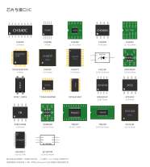
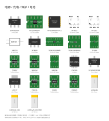
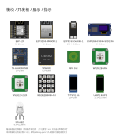
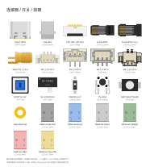
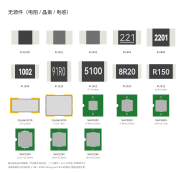
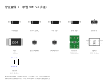

# fritzing-parts-langhua

Aurora Tessellation（极光镶嵌）项目使用的 Fritzing 自定义部件库。

> 本仓库最初是 `fritzing-parts` 的 fork：LM393-A3144-HALL-3Pins、PB86-A0 等用于 SandFlower 的部件仍保留。
## 元件预览（图 = 各部件自己的 icon 视图，自动拼版）

下面几张图就是本库元件的**真实外观**（内容取自各部件 `svg.icon.*_icon.svg`，由
`tools/make_preview.py` 自动拼版 —— 改了某个 icon，重跑一次脚本这些图就跟着更新）。
每个格子按各自比例缩放到框内，格下的数字 = 该 icon 文件**自己声明**的尺寸。
共 100 个元件（含 `_rev_1` 等变体）；`FPC05-2H10PX`、`SYB-118`、`LM393-A3144-HALL-3PINS`
没收录 —— 这三个的 icon 视图直接复用面包板 svg，没有独立 icon 文件（原因写在脚本里）。

**芯片与接口 IC** —— MCU / USB-UART / 理想二极管 / 存储 / LED 驱动 / 网络

[](docs/preview/chips.svg)

**电源 / 充电 / 保护 / 电池** —— DC-DC、LDO、充电 IC、锂电保护、电池

[](docs/preview/power.svg)

**模块 / 开发板 / 显示 / 指示** —— WiFi、HaLow、NFC、WS2812B、TFT、霍尔

[](docs/preview/modules.svg)

**连接器 / 开关 / 按键** —— Type-C、USB、FPC、RJ45、SMA、拨动开关、PB86-A0 六色

[](docs/preview/conn.svg)

**无源件** —— SMD 电阻 11 种尺寸、晶振、模压功率电感

[](docs/preview/passive.svg)

**分立器件** —— 肖特基 / TVS、双 MOS、排阻

[](docs/preview/discrete.svg)

> 尺寸口径：图上的数字是 icon 文件里 `width`/`height` **写明的**值（本库新做的元件按实物 1:1 画）；
> 早年从 `fritzing-parts` 导入的旧件若只写无单位数字（那是视觉比例、不是实物尺寸），图上就**不标数字**。

**同一个分组也能变成 Fritzing 里的元件箱**（不用在界面上一个个点）：

```bash
python tools/make_fzb.py             # 写成 <用户目录>/Documents/Fritzing/bins/fzh_*.fzb
```

重启 Fritzing 后，元件面板里会多出这 6 个箱（标题与上面的图一致），**每个箱内部还按用途分了小节**
（如电源箱：DC-DC / LDO / 锂电充电 / 锂电保护 / 电池）。分组表只有一份
——`tools/make_preview.py` 的 `SHEETS`（箱内小节表在 `tools/make_fzb.py` 的 `SECTIONS`，
两者必须盖住同一批元件，脚本会自检）——所以「README 里的图」与「Fritzing 里的箱」永远同源。
箱文件写在 `<用户目录>/Documents/Fritzing/bins`（**Fritzing 只读那里** —— 路径写死在 `folderutils.cpp`，
没有配置项），同时镜像一份到本仓 `fzb/`（同 `fzpz/` 的惯例：那层放 `.fzpz`，这层放 `.fzb` + 箱图标 PNG；
Fritzing 不读它，整目录拷回 Fritzing 目录即可恢复）。箱里存的是**本机已装零件的引用**（不是零件本体）
—— 所以换机器要重跑一次脚本，镜像那份里的路径也只对本机有效。

## 已有部件

> 下表由 `fzpz/` 目录自动核对生成（88 个 `.fzpz`），全部部件源文件在 `svg/<部件>/` 下，生成脚本为 `gen_part.py` 等。

| 部件 | 说明 | 交付物 |
|---|---|---|
| 3Pin-LED | 3 脚直插 LED（3mm） | `fzpz/3Pin-LED.fzpz` |
| 8205HA | 20V N 沟道 MOSFET（SOT23-6） | `fzpz/8205HA.fzpz` |
| 8205S | 双 N 沟道 MOSFET（SOT23-6） | `fzpz/8205S.fzpz` |
| BAT54S | SOT-23 双肖特基二极管（3 脚） | `fzpz/BAT54S.fzpz` |
| CH213K | 低压差理想二极管芯片，带限流（SOT23-3） | `fzpz/CH213K.fzpz` |
| CH32V203C8T6 | CH32V203C8T6 主控（QingKe RISC-V MCU，LQFP48，48 脚，与 STM32F103C8T6 兼容排布） | `fzpz/CH32V203C8T6.fzpz` |
| CH340C | USB 转串口芯片（SOP-16，TXW8301 模拟器 USB-UART 桥） | `fzpz/CH340C.fzpz` |
| CH340E | USB 转串口芯片（MSOP-10，内置时钟） | `fzpz/CH340E.fzpz` |
| CH340K | USB 转串口芯片（essop-10） | `fzpz/CH340K.fzpz` |
| CH340X | USB 转串口芯片（msop-10） | `fzpz/CH340X.fzpz` |
| DW01A / DW03 / DW06D | 单节锂电保护 IC（SOT23-5/6） | `fzpz/DW01A.fzpz`、`DW03.fzpz`、`DW06D.fzpz` |
| EC190708 | 按键开关机控制器（SOT23-6） | `fzpz/EC190708.fzpz` |
| ETA3425S2F | 1µA 静态电流 0.6A 同步降压 DC-DC（ETA3425，SOT23-5 型） | `fzpz/ETA3425S2F.fzpz` |
| ESP-12F | ESP8266 模块（16 脚） | `fzpz/ESP-12F.fzpz` |
| ESP32-S3-DevKitC-1 | ESP32-S3 开发板（63.5×28mm，44 脚） | `fzpz/ESP32-S3-DevKitC-1.fzpz` |
| ESP32-S3-WROOM-1 | ESP32-S3 WiFi+BLE 模块（18×25.5mm，40 焊盘） | `fzpz/ESP32-S3-WROOM-1.fzpz` |
| ESP8266-CH340-SSD1306 | ESP8266 + SSD1306 组合板 | `fzpz/ESP8266-CH340-SSD1306.fzpz` |
| FPC05-2H10PX | SMD FPC 连接器（10 脚 0.5mm） | `fzpz/FPC05-2H10PX.fzpz` |
| FPC-05F-12P-H15 | FFC/FPC 连接器 0.5mm/12P，翻盖式/前翻、下接，H1.5 | `fzpz/FPC-05F-12P-H15.fzpz` |
| LM393-A3144-HALL-3PINS | LM393 + A3144 霍尔传感器模块（3 脚） | `fzpz/LM393-A3144-HALL-3PINS.fzpz` |
| Li300mAh | 3.7V 300mAh 锂聚合物电池（302050，XH2.54 座） | `fzpz/Li300mAh.fzpz` |
| Li300mAh-1.25 | 3.7V 300mAh 锂聚合物电池（302050，MX1.25 座） | `fzpz/Li300mAh-1.25.fzpz` |
| Li300mAh-1.25-SMD | 3.7V 300mAh 锂聚合物电池（302050，MX1.25 SMD 座） | `fzpz/Li300mAh-1.25-SMD.fzpz` |
| MAX40200 | 1A 超低压降理想二极管（SOT23-5） | `fzpz/MAX40200.fzpz` |
| ME4054 | 锂电充电驱动（20–500mA，SOT23-5） | `fzpz/ME4054.fzpz` |
| NetLabel-Pad | 网络标签式接口焊盘：原理图显示信号名、PCB 为大圆通孔焊盘（φ3mm/孔φ1.2mm，可插 2.54 排针） | `fzpz/NetLabel-Pad.fzpz` |
| NFC Coil | 13.56MHz NFC 感应线圈（PCB 螺旋，20mm、6 匝，通孔） | `fzpz/NFC-Coil.fzpz` |
| PB86-A0 | PB86-A0 按键（黑/蓝/灰/绿/红/黄 6 色） | `fzpz/PB86-A0-*.fzpz` |
| PC817_SOP4 | Sharp PC817 光耦（SMD） | `fzpz/PC817_SOP4.fzpz` |
| RT6150AGQW | 电流模式降压-升压 DC/DC（WDFN-10L 3×3） | `fzpz/RT6150AGQW.fzpz` |
| RT6150AGQW rev.1 | 电流模式降压-升压 DC/DC（WDFN-10L 3×3，写实工业风修订版；moduleId=`RT6150AGQW_rev_1`，EP 散热焊盘独立编号 11） | `fzpz/RT6150AGQW_rev_1.fzpz` |
| RT9013 / RT9193 | 低压差 LDO（SOT-23-5） | `fzpz/RT9013.fzpz`、`RT9193.fzpz` |
| Resistor-01005~2512 | SMD 电阻（11 种尺寸：01005/0201/0402/0603/0805/1206/1210/1812/2010/2512） | `fzpz/Resistor-*.fzpz` |
| SAM8108 | 开关机 IC（SOT23-6） | `fzpz/SAM8108.fzpz` |
| SHC0420~SHC1265 | 模压功率电感（0420/0520/0630/1040/1250/1265） | `fzpz/SHC*.fzpz` |
| SM5206 | 锂电充电驱动（esop8） | `fzpz/SM5206.fzpz` |
| SM5701 | DC-DC（0.9–6.5V 输入，3.3V 输出，SOT23-3） | `fzpz/SM5701.fzpz` |
| SMA-PJ1.7-L9.5 | SMA 天线母座连接器（直插，L9.5，SIG+GND×4；面包板=绿色转接板） | `fzpz/SMA-PJ1.7-L9.5.fzpz` |
| SOD-123 / SOD-323 / SOD-523 | 肖特基整流二极管（1N5819，SMD） | `fzpz/SOD-*.fzpz` |
| SOD-123FL | 瞬态电压抑制 TVS 二极管（SMD） | `fzpz/SOD-123FL.fzpz` |
| SYB-118 | 面包板（简易搭电路用） | `fzpz/SYB-118.fzpz` |
| TFTSPI1.9in | 8 脚 1.9 寸 TFT LCD（SPI） | `fzpz/TFTSPI1.9in.fzpz` |
| TM1637 / TM1638 | LED 驱动控制 IC（带键盘扫描，sop20/sop28） | `fzpz/TM1637.fzpz`、`TM1638.fzpz` |
| TP4056 / TP4057 | 锂电充电 IC（sop8/SOT23-6） | `fzpz/TP4056.fzpz`、`TP4057.fzpz` |
| TPS63051RMWR | 降压-升压开关稳压（2.5×2.5mm，VQFN-HR-12） | `fzpz/TPS63051RMWR.fzpz` |
| TPS631000DRLR | 1.5A 高功率密度降压-升压（sot583） | `fzpz/TPS631000DRLR.fzpz` |
| TS-D014 | 卧式拨动开关 | `fzpz/TS-D014.fzpz` |
| TS3A44159PWR | 四路 SPDT / 双 DPDT 双向模拟开关（1.65–4.3V，TSSOP-16/PW） | `fzpz/TS3A44159PWR.fzpz` |
| TX-AH-R900PNR | 泰芯 802.11ah EVB 开发板（70×55mm：TXW8301 模组 + CON1/CON2/CON3/DEBUG-PORT + 左 microSD 卡板 + 右侧 USB-A；三排针同格可插面包板） | `fzpz/TX-AH-R900PNR.fzpz` |
| TXW8301 | 泰芯 802.11ah SoC（WiFi HaLow，QFN48，49 脚含 EPAD；面包板=绿色转接板，pin1 左下） | `fzpz/TXW8301.fzpz` |
| CD74HC4067 | 16 通道模拟多路选择器（TSSOP-24/PW，端子 C0~C15/SIG/S0~S3/EN/VCC/GND） | `fzpz/CD74HC4067.fzpz` |
| Crystal-3215 | 32.768KHz 石英晶振（3.2×1.5mm SMD，4 焊盘） | `fzpz/Crystal-3215.fzpz` |
| Crystal-3225 | 8MHz 石英晶振（3.2×2.5mm SMD，4 焊盘） | `fzpz/Crystal-3225.fzpz` |
| DPDT7x7-6P | 7.0×7.0 自锁按键开关（DPDT 双刀，6 脚：左右各 3 排针 2.0mm 针距，1 脚左下） | `fzpz/DPDT7x7-6P.fzpz` |
| TypeC16Pin | USB Type-C 连接器（16 脚） | `fzpz/TypeC16Pin.fzpz` |
| UART1.9inIPS | 1.9 寸 IPS TFT LCD（4 脚） | `fzpz/UART1.9inIPS.fzpz` |
| ATECC608B | Microchip CryptoAuthentication 安全元件（I2C，SOIC-8；4 个功能脚 GND/SDA/SCL/VCC + 4 个 NC；面包板=绿色转接板，排针行距 7.62mm，pin1 左下） | `fzpz/ATECC608B.fzpz` |
| W25Q16JV | 16M-bit SPI NOR Flash（Winbond，SOIC-8 208-mil） | `fzpz/W25Q16JV.fzpz` |
| XC6206P332MR | 3.3V 低压差线性稳压器 LDO（Torex XC6206 系列，SOT-23-3，200mA；面包板=淘宝式转接板，排针 2/3/1=VOUT/VIN/GND） | `fzpz/XC6206P332MR.fzpz` |
| WS2812B-2020 | 2.0×2.0mm 可寻址 RGB LED（内置驱动） | `fzpz/WS2812B-2020.fzpz` |
| WS2812B-5050 | 5.0×5.0mm 可寻址 RGB LED（内置驱动） | `fzpz/WS2812B-5050.fzpz` |
| WS2812B-5050-4x4 | 4×4 可寻址 RGB LED 矩阵模块（5050 灯珠，~30×30mm，排针 GND/5V/DIN/GND + 独立 DOUT） | `fzpz/WS2812B-5050-4x4.fzpz` |
| YC164 | 排阻（YC164，8 脚） | `fzpz/YC164.fzpz` |

另：`svg/NFC-Coil/coil_4x4_array.svg` 为 φ19mm 4×4 阵列铜层 SVG（非独立元件）。

## 开发指南

做新部件（TS3A44159 等）前必读：[Fritzing 自定义部件开发指南](docs/part-dev-guide.md)
