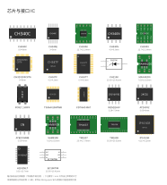
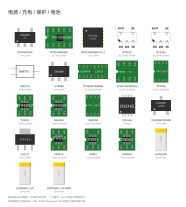
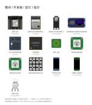
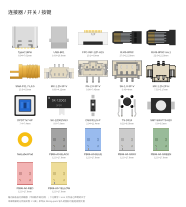
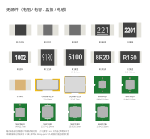
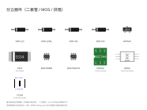

# fritzing-parts-langhua

Aurora Tessellation（极光镶嵌）项目使用的 Fritzing 自定义部件库。

> 本仓库最初是 `fritzing-parts` 的 fork：LM393-A3144-HALL-3Pins、PB86-A0 等用于 SandFlower 的部件仍保留。
## 元件预览（图 = 各部件自己的 icon 视图，自动拼版）

下面几张图就是本库元件的**真实外观**（内容取自各部件 `svg.icon.*_icon.svg`，由
`tools/make_preview.py` 自动拼版 —— 改了某个 icon，重跑一次脚本这些图就跟着更新）。
每个格子按各自比例缩放到框内，格下的数字 = 该 icon 文件**自己声明**的尺寸。
共 116 个元件（含 `_rev_1` 等变体）；`FPC05-2H10PX`、`LM393-A3144-HALL-3PINS`
没收录 —— 这两个的 icon 视图直接复用面包板 svg，没有独立 icon 文件（原因写在脚本里）。
★ `SYB-118` 自 2026-10-05 起**有自己的 icon** ✓（面包板图**右端切片** ✓：竖排 "SYB-118" 丝印 ＋ 两个安装孔 ✓，**方形 44.92 × 44.92 mm** ✓ —— 用户定"icon 应该是方的，不是长方形的" ✓），生成器 `svg/SYB-118/gen_icon.py` ✓。

**芯片与接口 IC** —— MCU / USB-UART / 理想二极管 / 存储 / LED 驱动 / 网络

[](docs/preview/chips.svg)

**电源 / 充电 / 保护 / 电池** —— DC-DC、LDO、充电 IC、锂电保护、电池

[](docs/preview/power.svg)

**模块 / 开发板 / 显示 / 指示** —— WiFi、HaLow、NFC、WS2812B、TFT、霍尔

[](docs/preview/modules.svg)

**连接器 / 开关 / 按键** —— Type-C、USB、FPC、RJ45、SMA、拨动开关、PB86-A0 六色

[](docs/preview/conn.svg)

**无源件** —— SMD 电阻 11 种尺寸、**SMD 电容 0402**、晶振、模压功率电感

[](docs/preview/passive.svg)

**分立器件** —— 肖特基 / TVS、双 MOS、排阻

[](docs/preview/discrete.svg)

> 尺寸口径：图上的数字是 icon 文件里 `width`/`height` **写明的**值（本库新做的元件按实物 1:1 画）；
> 早年从 `fritzing-parts` 导入的旧件若只写无单位数字（那是视觉比例、不是实物尺寸），图上就**不标数字**。

**同一个分组也能变成 Fritzing 里的元件箱**（不用在界面上一个个点）：

```bash
python tools/make_fzb.py             # 写成 <用户目录>/Documents/Fritzing/bins/fzh_*.fzb
```

重启 Fritzing 后，元件面板里会多出这 6 个箱（标题与上面的图一致），**每个箱内部还按用途分了小节**
（如电源箱：DC-DC / LDO / 锂电充电 / 锂电保护 / 电池）。分组表只有一份
——`tools/make_preview.py` 的 `SHEETS`（箱内小节表在 `tools/make_fzb.py` 的 `SECTIONS`，
两者必须盖住同一批元件，脚本会自检）——所以「README 里的图」与「Fritzing 里的箱」永远同源。
箱文件写在 `<用户目录>/Documents/Fritzing/bins`（**Fritzing 只读那里** —— 路径写死在 `folderutils.cpp`，
没有配置项），同时镜像一份到本仓 `fzb/`（同 `fzpz/` 的惯例：那层放 `.fzpz`，这层放 `.fzb` + 箱图标 PNG；
Fritzing 不读它，整目录拷回 Fritzing 目录即可恢复）。箱里存的是**本机已装零件的引用**（不是零件本体）
—— 所以换机器要重跑一次脚本，镜像那份里的路径也只对本机有效。

## 已有部件

> 下表由 `fzpz/` 目录自动核对生成（120 个 `.fzpz`），全部部件源文件在 `svg/<部件>/` 下，生成脚本为 `gen_part.py` 等。

| 部件 | 说明 | 交付物 |
|---|---|---|
| 3Pin-LED | 3 脚直插 LED（3mm） | `fzpz/3Pin-LED.fzpz` |
| 8205HA | 20V N 沟道 MOSFET（SOT23-6） | `fzpz/8205HA.fzpz` |
| 8205S | 双 N 沟道 MOSFET（SOT23-6） | `fzpz/8205S.fzpz` || AT24C02 | I2C 串行 EEPROM（2Kbit，SOP-8，A0~A2/WP） | `fzpz/AT24C02.fzpz` |
| BAS70BRW | 4×70V 梃基二极管阵列（SOT-363 / SC-70-6，两个串联对、6 个节点全出；丝印 K75） | `fzpz/BAS70BRW.fzpz` |
| BAS70DW-04 | 4×70V 梃基二极管阵列（SOT-363 / SC-70-6，两个串联对、6 个节点全出；丝印 K74） | `fzpz/BAS70DW-04.fzpz` || BAT54S | SOT-23 双肖特基二极管（3 脚） | `fzpz/BAT54S.fzpz` |
| CH213K | 低压差理想二极管芯片，带限流（SOT23-3） | `fzpz/CH213K.fzpz` |
| CH32V002D4U6 | CH32V002 主控（QingKe RISC-V MCU，QFN12，12 脚 + EPAD 散热焊盘） | `fzpz/CH32V002D4U6.fzpz` |
| CH32V002F4U6 | CH32V002 主控（QFN20，20 脚 + EPAD） | `fzpz/CH32V002F4U6.fzpz` |
| CH32V002J4M6 | CH32V002 主控（SOP8，8 脚） | `fzpz/CH32V002J4M6.fzpz` |
| CH32V003F4U6 | CH32V003 主控（QFN20，20 脚 + EPAD） | `fzpz/CH32V003F4U6.fzpz` |
| CH32V003J4M6 | CH32V003 主控（SOP8，8 脚） | `fzpz/CH32V003J4M6.fzpz` |
| CH32V203C8T6 | CH32V203C8T6 主控（QingKe RISC-V MCU，LQFP48，48 脚，与 STM32F103C8T6 兼容排布） | `fzpz/CH32V203C8T6.fzpz` |
| CH340C | USB 转串口芯片（SOP-16，TXW8301 模拟器 USB-UART 桥） | `fzpz/CH340C.fzpz` |
| CH340E | USB 转串口芯片（MSOP-10，内置时钟） | `fzpz/CH340E.fzpz` |
| CH340K | USB 转串口芯片（essop-10） | `fzpz/CH340K.fzpz` |
| CH340N | WCH USB 转串口（SOP-8，外围最简） | `fzpz/CH340N.fzpz` |
| CH340X | USB 转串口芯片（msop-10） | `fzpz/CH340X.fzpz` |
| CH347F | WCH USB 桥接（QFN28：USB ↔ JTAG/SPI/I2C/UART 等；EPAD 独立成网） | `fzpz/CH347F.fzpz` |
| CH347T | WCH USB 桥接（TSSOP20；板上有 IO 跳线配置区） | `fzpz/CH347T.fzpz` |
| CN3165 | 锂电充电管理 IC（DFN-8） | `fzpz/CN3165.fzpz` |
| DW01A / DW03 / DW06D | 单节锂电保护 IC（SOT23-5/6） | `fzpz/DW01A.fzpz`、`DW03.fzpz`、`DW06D.fzpz` |
| EC190708 | 按键开关机控制器（SOT23-6） | `fzpz/EC190708.fzpz` |
| ETA3425S2F | 1µA 静态电流 0.6A 同步降压 DC-DC（ETA3425，SOT23-5 型） | `fzpz/ETA3425S2F.fzpz` |
| ESP-12F | ESP8266 模块（16 脚） | `fzpz/ESP-12F.fzpz` |
| ESP32-S3-DevKitC-1 | ESP32-S3 开发板（63.5×28mm，44 脚） | `fzpz/ESP32-S3-DevKitC-1.fzpz` |
| ESP32-S3-WROOM-1 | ESP32-S3 WiFi+BLE 模块（18×25.5mm，40 焊盘） | `fzpz/ESP32-S3-WROOM-1.fzpz` |
| ESP8266-CH340-SSD1306 | ESP8266 + SSD1306 组合板 | `fzpz/ESP8266-CH340-SSD1306.fzpz` |
| FPC05-2H10PX | SMD FPC 连接器（10 脚 0.5mm） | `fzpz/FPC05-2H10PX.fzpz` |
| FPC-05F-12P-H15 | FFC/FPC 连接器 0.5mm/12P，翻盖式/前翻、下接，H1.5 | `fzpz/FPC-05F-12P-H15.fzpz` |
| H1102NLT | Pulse 网络隔离变压器（16 脚 SOIC；4/5/12/13 = NC） | `fzpz/H1102NLT.fzpz` |
| IP101GR | 单口快速以太网 PHY（IC+，QFN-32 + EPAD） | `fzpz/IP101GR.fzpz` |
| LD1117 | 三端 LDO 稳压器（SOT-223，可调/固定） | `fzpz/LD1117.fzpz` |
| LM393-A3144-HALL-3PINS | LM393 + A3144 霍尔传感器模块（3 脚） | `fzpz/LM393-A3144-HALL-3PINS.fzpz` |
| Li300mAh | 3.7V 300mAh 锂聚合物电池（302050，XH2.54 座） | `fzpz/Li300mAh.fzpz` |
| Li300mAh-1.25 | 3.7V 300mAh 锂聚合物电池（302050，MX1.25 座） | `fzpz/Li300mAh-1.25.fzpz` |
| Li300mAh-1.25-SMD | 3.7V 300mAh 锂聚合物电池（302050，MX1.25 SMD 座） | `fzpz/Li300mAh-1.25-SMD.fzpz` |
| MAX40200 | 1A 超低压降理想二极管（SOT23-5） | `fzpz/MAX40200.fzpz` |
| ME4054 | 锂电充电驱动（20–500mA，SOT23-5） | `fzpz/ME4054.fzpz` |
| MX-1.25-3P-V | 1.25mm **3P 立贴母座**（板端 SMD 插座；icon = 厂商图纸俯视图 1:1 抄图后手工修，8.65×4.12mm；面包板 = 绿色转接板，3 个 2.54mm 排针） | `fzpz/MX-1.25-3P-V.fzpz` |
| MX-1.25-2P-H | 1.25mm **2P 卧贴母座**（板端卧式 SMD 插座；icon = 厂商图纸俯视图 1:1 抄图后手工修，7.52×5.17mm；面包板 = 绿色转接板，2 个 2.54mm 排针） | `fzpz/MX-1.25-2P-H.fzpz` |
| PH-2.0-3P-V | 2.0mm **3P 立贴母座**（板端 SMD 插座；icon = 厂商图纸俯视图 1:1 抄图后手工修，9.96×7.45mm；面包板 = 绿色转接板，3 个 2.54mm 排针） | `fzpz/PH-2.0-3P-V.fzpz` |
| SH-1.0-3P-V | 1.0mm **3P 立贴母座**（板端 SMD 插座；icon = 厂商图纸俯视图 1:1 抄图后手工修，5.43×4.00mm；面包板 = 绿色转接板，3 个 2.54mm 排针） | `fzpz/SH-1.0-3P-V.fzpz` |
| NetLabel-Pad | 网络标签式接口焊盘：原理图显示信号名、PCB 为大圆通孔焊盘（φ3mm/孔φ1.2mm，可插 2.54 排针） | `fzpz/NetLabel-Pad.fzpz` |
| NFC Coil | 13.56MHz NFC 感应线圈（PCB 螺旋，20mm、6 匝，通孔） | `fzpz/NFC-Coil.fzpz` |
| PB86-A0 | PB86-A0 按键（黑/蓝/灰/绿/红/黄 6 色） | `fzpz/PB86-A0-*.fzpz` |
| PC817_SOP4 | Sharp PC817 光耦（SMD） | `fzpz/PC817_SOP4.fzpz` |
| RJ45-8P8C | RJ45 网口（8P8C 直插，本体 11.63×27.00mm；面包板 = 绿色转接板） | `fzpz/RJ45-8P8C.fzpz` |
| RJ45-8P8C rev.1 | RJ45 网口修订版（模块本体改 11.63×22.00mm；moduleId=`RJ45-8P8C_rev_1`） | `fzpz/RJ45-8P8C_rev_1.fzpz` |
| RT6150AGQW | 电流模式降压-升压 DC/DC（WDFN-10L 3×3） | `fzpz/RT6150AGQW.fzpz` |
| RT6150AGQW rev.1 | 电流模式降压-升压 DC/DC（WDFN-10L 3×3，写实工业风修订版；moduleId=`RT6150AGQW_rev_1`，EP 散热焊盘独立编号 11） | `fzpz/RT6150AGQW_rev_1.fzpz` |
| RT9013 / RT9193 | 低压差 LDO（SOT-23-5） | `fzpz/RT9013.fzpz`、`RT9193.fzpz` |
| Resistor-01005~2512 | SMD 电阻（11 种尺寸：01005/0201/0402/0603/0805/1206/1210/1812/2010/2512） | `fzpz/Resistor-*.fzpz` |
| Capacitor-0402 | SMD 陶瓷电容 0402（默认属性 **100nF / 25V / X7R / ±10%**，值可在 Fritzing 里改；焊盘 = 同封装电阻的 land pattern；面包板 = Fritzing 自带电容的面包板） | `fzpz/Capacitor-0402.fzpz` |
| SAM8108 | 开关机 IC（SOT23-6） | `fzpz/SAM8108.fzpz` |
| SHC0420~SHC1265 | 模压功率电感（0420/0520/0630/1040/1250/1265） | `fzpz/SHC*.fzpz` |
| SK-12D02VG3 | 滑动开关（SPDT，5 脚 = 3+2；本体 8.6×4.4×4.7mm） | `fzpz/SK-12D02VG3.fzpz` |
| SM5206 | 锂电充电驱动（esop8） | `fzpz/SM5206.fzpz` |
| SM5701 | DC-DC（0.9–6.5V 输入，3.3V 输出，SOT23-3） | `fzpz/SM5701.fzpz` |
| SMA-PJ1.7-L9.5 | SMA 天线母座连接器（直插，L9.5，SIG+GND×4；面包板=绿色转接板） | `fzpz/SMA-PJ1.7-L9.5.fzpz` |
| SS34 | 梃基整流二极管（DO-214AC / SMA） | `fzpz/SS34.fzpz` |
| SOD-123 / SOD-323 / SOD-523 | 肖特基整流二极管（1N5819，SMD） | `fzpz/SOD-*.fzpz` |
| SOD-123FL | 瞬态电压抑制 TVS 二极管（SMD） | `fzpz/SOD-123FL.fzpz` |
| SY8089 | Silergy 同步降压 DC-DC（SOT-23-5） | `fzpz/SY8089.fzpz` |
| SYB-118 | 面包板（690 孔；孔只在面包板视图里声明 ✓） | `fzpz/SYB-118.fzpz` |
| T-Halow-RJ45 | 泰芯 HaLow + RJ45 参考板（T-Halow-RJ45 仓的参考件；不进本库预览图/元件箱） | `fzpz/T-Halow-RJ45.fzpz` |
| TFTSPI1.9in | 8 脚 1.9 寸 TFT LCD（SPI） | `fzpz/TFTSPI1.9in.fzpz` |
| TM1637 / TM1638 | LED 驱动控制 IC（带键盘扫描，sop20/sop28） | `fzpz/TM1637.fzpz`、`TM1638.fzpz` |
| TP4056 / TP4057 | 锂电充电 IC（sop8/SOT23-6） | `fzpz/TP4056.fzpz`、`TP4057.fzpz` |
| TPS63051RMWR | 降压-升压开关稳压（2.5×2.5mm，VQFN-HR-12） | `fzpz/TPS63051RMWR.fzpz` |
| TPS631000DRLR | 1.5A 高功率密度降压-升压（sot583） | `fzpz/TPS631000DRLR.fzpz` |
| TS-D014 | 卧式拨动开关 | `fzpz/TS-D014.fzpz` |
| TS3A44159PWR | 四路 SPDT / 双 DPDT 双向模拟开关（1.65–4.3V，TSSOP-16/PW） | `fzpz/TS3A44159PWR.fzpz` |
| TX-AH-R900PNR | 泰芯 802.11ah EVB 开发板（70×55mm：TXW8301 模组 + CON1/CON2/CON3/DEBUG-PORT + 左 microSD 卡板 + 右侧 USB-A；三排针同格可插面包板） | `fzpz/TX-AH-R900PNR.fzpz` |
| TX-AH-R900PNR rev.1 | 泰芯 802.11ah EVB 开发板修订版（38 脚；moduleId=`TX-AH-R900PNR_rev_1`） | `fzpz/TX-AH-R900PNR_rev_1.fzpz` |
| TXW8301 | 泰芯 802.11ah SoC（WiFi HaLow，QFN48，49 脚含 EPAD；面包板=绿色转接板，pin1 左下） | `fzpz/TXW8301.fzpz` |
| CD74HC4067 | 16 通道模拟多路选择器（TSSOP-24/PW，端子 C0~C15/SIG/S0~S3/EN/VCC/GND） | `fzpz/CD74HC4067.fzpz` |
| Crystal-3215 | 32.768KHz 石英晶振（3.2×1.5mm SMD，4 焊盘） | `fzpz/Crystal-3215.fzpz` |
| Crystal-3225 | 8MHz 石英晶振（3.2×2.5mm SMD，4 焊盘） | `fzpz/Crystal-3225.fzpz` |
| DSIC01LS-P | 直插拨码开关（SPST、2 脚；本体 4.06×6.20mm） | `fzpz/DSIC01LS-P.fzpz` |
| DPDT7x7-6P | 7.0×7.0 自锁按键开关（DPDT 双刀，6 脚：左右各 3 排针 2.0mm 针距，1 脚左下） | `fzpz/DPDT7x7-6P.fzpz` |
| TypeC16Pin | USB Type-C 连接器（16 脚） | `fzpz/TypeC16Pin.fzpz` |
| UART1.9inIPS | 1.9 寸 IPS TFT LCD（4 脚） | `fzpz/UART1.9inIPS.fzpz` |
| USB-B01 | USB-B 母座（直角直插） | `fzpz/USB-B01.fzpz` |
| ATECC608B | Microchip CryptoAuthentication 安全元件（I2C，SOIC-8；4 个功能脚 GND/SDA/SCL/VCC + 4 个 NC；面包板=绿色转接板，排针行距 7.62mm，pin1 左下） | `fzpz/ATECC608B.fzpz` |
| W25Q16JV | 16M-bit SPI NOR Flash（Winbond，SOIC-8 208-mil） | `fzpz/W25Q16JV.fzpz` |
| XC6206P332MR | 3.3V 低压差线性稳压器 LDO（Torex XC6206 系列，SOT-23-3，200mA；面包板=淘宝式转接板，排针 2/3/1=VOUT/VIN/GND） | `fzpz/XC6206P332MR.fzpz` |
| WS2812B-1010 | 1.0×1.0mm 可寻址 RGB LED（内置驱动，4 个底面焊盘、0.40mm 网格） | `fzpz/WS2812B-1010.fzpz` |
| WS2812B-2020 | 2.0×2.0mm 可寻址 RGB LED（内置驱动） | `fzpz/WS2812B-2020.fzpz` |
| WS2812B-5050 | 5.0×5.0mm 可寻址 RGB LED（内置驱动） | `fzpz/WS2812B-5050.fzpz` |
| WS2812B-5050-4x4 | 4×4 可寻址 RGB LED 矩阵模块（5050 灯珠，~30×30mm，排针 GND/5V/DIN/GND + 独立 DOUT） | `fzpz/WS2812B-5050-4x4.fzpz` |
| YC164 | 排阻（YC164，8 脚） | `fzpz/YC164.fzpz` |
| SMT-SW-PTS-820 | C&K **PTS820** 系列贴片轻触开关（**SPST 常开**、瞬时动作；本体 **3.9×2.9mm**、高 **H=2.0mm**、J 型端子、两端中心距 **4.15mm**；面包板=绿色转接板 7.62×11.43mm、两根 2.54mm 排针在下排内侧标 1/2） | `fzpz/SMT-SW-PTS-820.fzpz` |

另：`svg/NFC-Coil/coil_4x4_array.svg` 为 φ19mm 4×4 阵列铜层 SVG（非独立元件）。

## ★ 配套工具：PCB 版本差异视图（VS Code 扩展）

改板子时最想知道的一句话是「**这一版跟上一版到底差在哪儿**」✓ —— 本库自带一套工具回答它：

- `tools/diff_revs.py` ⇒ **一张叠合差异图**（**色相 = 层**：顶层橙 ✓ / 底层蓝 ✓；
  **深浅 = 版**：浅 = 旧 ✓ / 深 = 新 ✓；丝印/板框/位号 = 中性灰 ✓）＋ **差异清单**
  （哪个脚挪了几毫米 ✓、每张网被分成几块铜 ✓、过孔 ✓）；
- `tools/render_revs.py` ⇒ 把每一版都渲成图 ⇒ 也能用 VS Code 原生「比较选中的文件」并排看 ✓；
- 配套 **VS Code 扩展**把「图」和「清单」合成**一个界面** ✓，而且**点清单里一条 ⇒ 图上高亮那处变化** ✓
  （旧位置空心圈 ✓ / 新位置实心圈 ✓ / 虚线 ＋ Δmm ✓ / 其余变淡 ✓）：


**装**（一条命令装进你的 VS Code ✓，不用打包 `.vsix` ✓）：

```
tools\install_diff_ext.cmd          # 装完 Ctrl+Shift+P → Reload Window 即生效
```

**用**：资源管理器里**双击** `diff\diff-*.md` ✓，或命令面板 → `Pixel 差异: 比较两版` ✓
（要不要清单 ⇒ 给两个 `.fzz` ✓；含 **Fritzing 导出的 svg** 也能比 ✓，那种只出图 ✓）。

**一页一页翻着看** ✓：命令面板 → `Pixel 差异: 幻灯片` ⇒ 把所有差异按**版本号**串成一串 ✓，
`⟨上一条` / `下一条 ⟩` ✓、键盘 **←/→** ✓、**▶ 自动播放**（间隔可填 ✓、空格暂停 ✓），
**点清单一条照旧高亮** ✓。

**别的电路设计里也能用** ✓：扩展是**装一次全局**的 ✓（任何工作区都有这三个命令 ✓），
新项目一般只需两个设置（`pixelDiff.projectDir` / `pixelDiff.fzzPattern` ✓），认不准也能自动找 ✓
—— 怎么移植见 [`tools/vscode-diff/README.md`](tools/vscode-diff/README.md) ✓。

★ 工具细节、参数（`--dir` / `--pattern` / `--nets` ✓）、以及"坐标换算只有一份"等规矩，
见 [`tools/README.md`](tools/README.md) 的「VS Code 扩展」与「版本对比 / 长跑」两节 ✓。
卸载：`tools\install_diff_ext.cmd uninstall` ✓。

## 开发指南

做新部件（TS3A44159 等）前必读：[Fritzing 自定义部件开发指南](docs/part-dev-guide.md)

**好看的 icon 最后一手可以自己改**：抄厂商图纸 + 上色做出来的 icon，最后往往要在 Inkscape 里微调
（形状 / 颜色 / 该留白的地方）。改 `svg/<部件>/svg.icon.<部件>_icon_byHand.svg`（草稿，不入库），再跑

```bash
python tools/byhand_icon.py svg/MX-1.25-3P-V     # 手工版 → byHand_icon.py（纯数据，入库）
python svg/MX-1.25-3P-V/gen_part.py              # 生成器逐字采用你的版本
```

生成器**有手工版就用手工版**，所以重跑脚本不会再覆盖你的改动 ✓。

下面这**三个立贴母座**都是照这条路做出来的 —— 俯视图 1:1 抄自厂商图纸、上色，再在 Inkscape 里手工修
（米黄塑料本体 + 银色针脚/卡脚 + 银灰斜面）。**三张图同一比例**，所以画面上的大小 = 三者真实大小之比：

| [MX-1.25-3P-V](svg/MX-1.25-3P-V/svg.icon.MX-1.25-3P-V_icon.svg) | [PH-2.0-3P-V](svg/PH-2.0-3P-V/svg.icon.PH-2.0-3P-V_icon.svg) | [SH-1.0-3P-V](svg/SH-1.0-3P-V/svg.icon.SH-1.0-3P-V_icon.svg) |
|---|---|---|
| <a href="svg/MX-1.25-3P-V/svg.icon.MX-1.25-3P-V_icon.svg"></a> | <a href="svg/PH-2.0-3P-V/svg.icon.PH-2.0-3P-V_icon.svg"></a> | <a href="svg/SH-1.0-3P-V/svg.icon.SH-1.0-3P-V_icon.svg"></a> |
| **1.25mm** 3P　icon 8.65×4.12mm | **2.0mm** 3P　icon 9.96×7.45mm | **1.0mm** 3P　icon 5.43×4.00mm |

> 这三个都是**完整四视图**元件（icon / 面包板 / 原理图 / PCB 都已入库）；它们的 **PCB 焊盘尺寸与位置不是按 icon 量的**，
> 而是照嘉立创（成熟库）同规格封装定的 land pattern（MX ← `MX1.25-8P`、PH ← `CONN-SMD-PH2.0-1X3PW`、
> SH ← `SH1.0-3P-L`），规则见 [`AGENTS.md`](AGENTS.md) §10 第 16 条（PCB 焊盘 / 丝印的硬规矩）。

工具细节、以及另一条路（手工版导出**结构化表** `byHand_tables.py`，适合"图形由元件拼出来"的模组类）
见 [`tools/README.md`](tools/README.md)。

## ★ 2026-10-10：`SH-1.0-3P-V` 的丝印**漏进铜层** ✗ ⇒ 已修 ✓

**现象** ✓（用户从 Fritzing 导出 Gerber 后，`tools/gerber_check.py` 实测）：`pixel-pcb-v83_copperBottom.gbl`
的底铜里多出 **14 段 Ø0.12 mm** 的细线 ✗，与旁边 J2 的 24 mil 走线只隔 **0.0906 mm = 3.57 mil**（< 5 mil 下限 ✗）
⇒ **整批 Gerber 判「不可送板」** ✗。

**根因** ✓：`SH-1.0-3P-V` 的 pcb svg 把 `<g id="silkscreen">` **嵌在** `<g id="copper1">` **内部** ✗
—— `.fzp` 的 `pcbView` **只声明图层**（`copper1` / `silkscreen` ✓）、**不声明"哪块图形属于哪层"** ✗，
归属是 Fritzing 读 SVG 时按**组的 id** 认的 ✓ ⇒ 嵌在铜组里 ⇒ 那 7 条丝印线**被当铜导出** ✗
（每个实例 7 条 × `J1`/`J2` 两实例 = **14 段** ✓）。对照件 = `WS2812B-1010` ✓：它的
`<g id="silkscreen">` 与 `<g id="copper1">` 是**兄弟**（平级 ✓）⇒ 没这问题 ✓。

**改了什么** ✓（只改**层级** ✗，几何 / id / 线宽 / transform **一字未动** ✓）：

| 文件 | 改动 |
|---|---|
| `svg/SH-1.0-3P-V/gen_part.py` | `pcb_svg()`：丝印组**移出**铜组 ⇒ 与 `copper1` 平级（并写进函数注释与仓规 ✓） |
| `svg/SH-1.0-3P-V/svg.pcb.SH-1.0-3P-V_pcb.svg` | 重跑生成器后的产物（`silkscreen` 从 `copper1` 里挪到 `<svg>` 根下 ✓） |
| `fzpz/SH-1.0-3P-V.fzpz` | 同上（重打包 ✓）；★ 面包板 / 原理图 / icon 三个视图**逐字节未变** ✓（生成器可复现 ✓） |
| `tools/silk_nest_check.py`（新） | 「丝印组嵌在铜组里」的**扫描器** ✓：判据只有一句（**丝印组必须是铜组的兄弟** ✓）；本仓**既有 7 件**（`Crystal-3215/3225`、`FPC-05F-12P-H15`、`MX-1.25-2P-H`、`MX-1.25-3P-V`、`PH-2.0-3P-V`、`USB-B01`）是同一老写法 ✗ ⇒ 记在脚本的 `KNOWN` 台账里、**只报"台账外新出现的"** ✗ |

**前后 XML**（`svg.pcb.SH-1.0-3P-V_pcb.svg`，只贴形状部分 ✓）：

```diff
   <rect id="connector2pad" connectorname="3" x="0.750" y="2.384" width="0.50" height="1.20" .../>
-  <g id="silkscreen">
-   <line x1="-2.667" y1="2.600" x2="-1.480" y2="2.600" ... stroke-width="0.12" .../>
-   …（共 7 条）…
-  </g>
+ </g>
+ <g id="silkscreen">
+  <line x1="-2.667" y1="2.600" x2="-1.480" y2="2.600" ... stroke-width="0.12" .../>
+  …（共 7 条）…
  </g>
 </svg>
```

**复验** ✓（两路 ✓）：① 库仓 `tools/tests/run_all.py` ⇒ **exit 0** ✓；
② `tools/silk_nest_check.py` ⇒ 本件已不在名单里 ✓、台账外**新**的 **0** 个 ✓；
③ 项目仓里重新导出/复验后，底铜最小铜↔铜间距 **0.0906 mm（3.57 mil）→ 0.1414 mm（5.57 mil）** ⚠
（仍在嘉立创可做区内 ✓）、孤立铜岛 **8 → 0** ✓、
`gerber_check` 判 **「可送板」（exit 0）** ✓ —— 数据与操作步骤见
`AuroraTessellation-NFC/hardware/pixel/README.md` §五十三 ✓。

> ⚠ **遗留**（本轮**未处理** ✗，等用户点头 ✓）：上面那 7 件同样是老写法 ✗。它们的丝印线**也会**
> 被当铜导出 ✗，只是那几块板/那些位置凑巧没踩到 5 mil 下限 ✓ —— 要用时先跑
> `py -3.13 tools\silk_nest_check.py` 看有没有新的 ✓，改动方式与本件**同一处、同一种** ✓。
> ⚠ **另一条**：本件的丝印线宽 0.12 mm **< 嘉立创丝印下限 0.15 mm** ⚠ ⇒ 可能印不清（`silkBottom`
> 有 0.12 mm 真丝印线的 ⚠ 提示 ✓）—— 那是**另一个问题** ✗，本轮不动 ✓。
