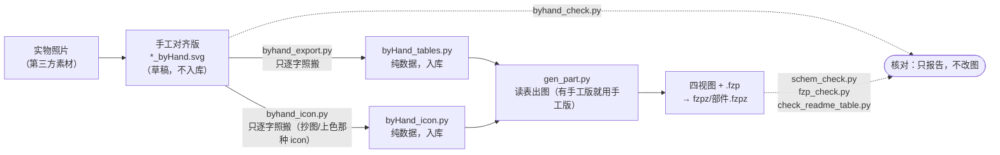

# `tools/` —— 元件开发辅助脚本（不参与打包）

## 为什么有这套东西（"照片对齐"工作流，用户 2026-09-15 定）

开发板/模组类元件的**面包板视图 = 整块实物板**，每个排针/元件的位置只能从实物照片量。
靠"目测象限摆位置"必然偏，所以改成：

1. **你在 Inkscape 里手工对齐**：把实物照片当底图，把排针/元件摆到照片上的实际位置，
   存成 `svg/<部件>/svg.breadboard.<部件>_breadboard_byHand.svg`
   （带照片、属草稿 → `.gitignore` 里已忽略 `*_byHand.svg`，不入库）
   ★ 这套流程**也用于 icon 视图**（2026-09-18 起，TX-AH-R900PNR 手画的模组顶视图）：
   `svg/<部件>/svg.icon.<部件>_icon_byHand.svg`
2. **导出成数据表**：`tools/byhand_export.py svg\<部件> [breadboard|icon]`
   （不写视图时先找 breadboard、再找 icon）
   → 生成 `svg/<部件>/byHand_tables.py`（纯数据，入库）
   ★ **一个部件两个视图都有手工版时**（TX-AH-R900PNR）：面包板那份另存
   `byHand_tables_breadboard.py`（规则见下面 2026-09-19 那节），icon 表名字不变。
   ★ **icon 手工版有两条路，按你“改的是什么”选**（2026-09-24 定，MX-1.25-3P-V 起）：
   · 改的是**版式/位置**（图形由元件拼出来的，如模组顶视图）→ 就用上面的
     `byhand_export.py … icon`：导出**结构化表**，位置变成数字，以后不开 Inkscape 也能挪 ✓
   · 改的是**形状/颜色**（icon 本身是抄厂商图纸 + 手工上色那种）→ 用
     `tools/byhand_icon.py svg\<部件>`：把图层**逐字**搬进 `svg/<部件>/byHand_icon.py`
     （`WIDTH_MM/HEIGHT_MM/VIEWBOX/INNER`），`gen_part.py` 原样搬进 `<g id="icon">`，
     **一笔不加工** —— 结构化重构会把手工调好的形状/颜色改掉 ✗
3. **生成器读表**：`gen_part.py` 里 `from byHand_tables import …`（icon 逐字版则是
   `from byHand_icon import INNER`）；以后要挪位置 = 改表里的数字（不用再开 Inkscape）

★ **手工版里常有嵌套 `group` + `transform`**（你在 Inkscape 里挪过元素）⇒ 取 `id="icon"`
图层时必须**按 `<g>` 标签配平扫描**；“非贪婪正则”只会截到第一个 `</g>` ✗
（面包板里嵌的那份也会跟着截断）。

之后这个部件就是**完全程序生成**的：`gen_part.py` 一跑，四视图 + `.fzp` + `.fzpz` 全部产出。

上面三步连起来就是这张图（实线 = 产出，虚线 = 核对；节点里的文件名就是仓库里那几份）：



**图里两个“看不见”的东西也在这条链上**：① 手工版带实物照片，所以**不入库**（只有导出出的
`byHand_tables.py` 进仓库）；② 核对工具是**独立**的 —— 它们只报告“差在哪”，不改图
（圆环与焊盘偏心这类问题要改**手工版**，见下面「约定」）。

## 待提给 Fritzing 上游的改进（TODO，2026-09-25 起）

> 立场：这些都是**成熟软件上的小摩擦**，不是"坑" ✗ —— 攒着，将来给 Fritzing 提 issue / PR 用 ✓。
> 每条都带**复现步骤**，可以直接贴进 issue 正文 ✓。

| # | 希望改进 | 现状 / 复现 | 出处 |
|---|---|---|---|
| 1 | **保存元件箱时保留"子分类"** | 子分类在我们生成的 `fzh_*.fzb` 里是 `<instance moduleIdRef="__spacer__" modelIndex="3" path="分类名"/>` ✓；在 Fritzing 里拖一个件 → 「保存元件箱」→ 重启 ⇒ **`__spacer__` 全没了、子分类消失** ✗（Fritzing 把 bin 整表重写 ✓）| 2026-09-25 实测 |
| 2 | **保存元件箱时别给实例补默认属性** | 同一操作后，每个 `<instance>` 被补上 `modelIndex="900126xx"` 与 `flippedSMD="true"` ✗（我们生成时没有 ✓）⇒ 脚本生成的 bin 被"改花" ✗ | 2026-09-25 |
| 3 | **插不进面包板时给一句原因** | 连接器引脚 `type="female"`（母）时，拖到面包板上**不吸附**、针脚落在两排孔之间 ✗，界面上看不出为什么 ✗。建议提示"该引脚是母的，面包板孔只能插公针" ✓ | 2026-09-25 |
| 4 | **支持 SVG 标准的 `dominant-baseline`** | 现在**不认**（cairosvg 也不认 ✗）⇒ 方框原理图的引脚名只能手动算基线偏移 ✓ | 长期 |
| 5 | **svg 尺寸写错时报错更明确** | ① 只写 `width` 缺 `height` ⇒ 弹「不能为 svg 创建渲染」✗（看不出是缺 `height` ✓）；② `schematic` 只写不带单位的数字 ⇒ 按默认 DPI 解释、尺寸超大 ✗（不报错 ✓）| 长期 |

**已经由我们这边解决的**（写在这里，免得误当上游问题 ✗）：面包板插孔要求引脚坐标落在
2.54 mm 网格上 + mm 尺寸换算 ✓、裸露焊盘命名与独立成网 ✓（都在 `AGENTS §5` ✓）。

## 脚本

| 脚本 | 干什么 |
|---|---|
| `byhand_export.py <部件目录> [breadboard\|icon]` | 手工版 → `byHand_tables.py`：嵌套 transform 累乘展开、单位统一成**内部单位**（100 = 2.54mm，**跟着文档的 width/height 走**，见下）、**`style=` 优先于同名属性**（CSS 规则）、**`SHAPES` 按文档次序**（保叠放）、按尺寸自动认图标（可用 `ICON_MATCH_BY_PART` 关）、丢掉照片与 Inkscape 壳、**隐藏图层整棵跳过**、多行文字按行拆、丝印统一字号（`FS_UNIFORM` / 大字规则 / 按部件关掉）、字重照搬、行距压紧（`LINE_PITCH`）、**`<path>` 照搬**（d + 累乘 matrix + 被引用的渐变）、焊盘（含**画成组**与**方形**）、圆角矩形的 `rx`（可选第 10 字段）、rect 的 `opacity`（可选第 11 字段）、导出 `PAD_R`/`PAD_SW`/`PAD_FILL`/`PAD_EDGE`/`DEFS`；**祖先组的 fill/stroke/stroke-width 会下发给缺失的后代**（2026-09-18）；目录名 ≠ 元件 id 时（如 `svg/TX-AH-R900PNR` 里文件都带 `_1`）按“本目录下该视图的手工版”兑底找 |
| `byhand_check.py <部件目录> [--png]` | 核对：元素计数（`text` 按**行**计）+ **加粗条数** + 每条文字的有效字号（能一眼看出整体缩放错）；`--png` 另出像素差与"左程序版 / 右手工版"对比图 |
| `byhand_icon.py <部件目录>` | **icon 专用的“逐字照搬”**（给“抄厂商图纸 + 手工上色”那种 icon 用，2026-09-24，MX-1.25-3P-V）：取 `<g id="icon">…</g>` 的**全部内容**（嵌套 group / transform / style 原样）+ `width/height/viewBox`，写成 `svg/<部件>/byHand_icon.py`（纯数据，入库）；Inkscape 的 `defs`/`sodipodi` 壳不带走。`gen_part.py` **有它就用它**（手工版优先，重跑不会覆盖你的改动）；与 `byhand_export.py … icon`（结构化表）的区别见上面「为什么有这套东西」 |
| `schem_check.py <部件目录> [--png] [--no-ccw]` | 核对**矩形符号原理图**（AGENTS §5）：① svg 头 width/height 齐不齐、viewBox 装不装得下 ② 每个脚 `connectorNpin`+`connectorNterminal` 齐不齐、端点是否落在引线末端 ③ 每脚一个编号（框外）+ 一个名（框内）、同字号 ④ **脚号逆时针连续**（沿 左→下→右→上 走一圈应是所有脚号的循环移位，且递增） |
| `fzp_check.py <部件目录> [--fzpz 包]` | 核对 `.fzp` ↔ 四个视图 svg：① 视图 `image=` 用**子目录路径** ② 每条 `svgId`/`terminalId` 在对应 svg 里真存在 ③ svg 里的 connector id 都被 .fzp 声明 ④ **svg 内 id 不重复** ⑤ `<buses>` 引用存在且不重复入总线 ⑥ **裸露焊盘（EPAD/EP）不许进任何总线**（独立成网、布线时特意接 GND，AGENTS §5）⑦ 面包板里同名焊盘必须在同一条总线里（NC/DNP 除外）⑧ `--fzpz` 包内**平铺**且成员齐全 |
| `sch_style_check.py <sketch.fzz\|.fz> [--view schematic] [--pitch 100]` | 核对**电路层**（一张图摆得对不对；规则正文见 `docs/schem-drawing-rules.md` A 节）：① **网格只作参考**（Fritzing 存的是**连续坐标**、网格相位由画布定 ✗ ⇒ 打印相位分布与偏离点，**不判 FAIL** ✓；`gridSize` 带单位 `0.1in`/`1mm` ⇒ 换算成 mil ✓）② **位号**：重复（FAIL）／前缀不像元件类型（提示）／排号顺序不是“先左后右先上后下”（提示）③ **名字只差大小写**（FAIL ✓，KiCad 同款告警）。`.fz` 结构两处不显然（实测过 ✓）：sketch 级 `<view name>` 是**驼峰** `schematicView` ✓；**导线也是 `<instance>`**（`Wire39`，坐标在 `<geometry x1..y2>`、折点 `<point>`）✓ |
| `copy_top.py <pdf> <out.svg> [<部件目录>/icon_art.py] [选项]` | 抄厂商 PDF 的**顶视图矢量**、可选剪掉多余脚位 ⇒ 出 SVG + 纯数据 `icon_art.py`（2026-09-24 用户定，MX-1.25-3P-V / PH-2.0-3P-V / SH-1.0-3P-V）。要点：① **标定比例**用 `--pitch`（脚距多少 pt）+ `--pitch-mm`（脚距多少 mm，默认 1.25 —— 1.0/2.0 系列必须显式给），并且**两个已知量互校**；② `--region` 必须把整套图**完全包住**；③ `--nocut` 原样照抄；④ 剪脚位**只剪脚位区**，两端的**卡耳不许裁**（AGENTS §10.11）；⑤ `--clip`：跨出区域的长线**按边界裁断保留** —— 图纸里「卡耳外缘」与「尺寸延长线」常是**同一条线**（PH2.0 立贴），整条丢就丢卡耳、整条留就带进尺寸线，只能裁断；⑥ `--drop x0,y0,x1,y1`（可多次）删掉完全落在该矩形内的图元，**裁断后的碎片也删** —— 清夹在脚位中间、区域躲不掉的尺寸线（SH1.0 立贴的 1.10/0.20）；⑦ `--stroke`/`--color` 重定线宽线色（图纸原线宽 ≈0.026mm，缩到 icon 就看不见，AGENTS §10.10）。被裁/被删的图元**逐条报出** ⇒ 必须核对「报出来的全是尺寸线」 |
| `check_readme_table.py` | 核对 **README「已有部件」表 ↔ `fzpz/`**（AGENTS §11 第 3/5 步的机器守，2026-09-24 —— 因 8 件元件"进了 `fzpz/`、进了元件箱，却漏登 README 表"而写）：① **漏登**（`fzpz/*.fzpz` 里 README 一个字都没提到的；支持 `fzpz/PB86-A0-*.fzpz` 这类**通配行**，也支持一行写多件；只写了名字、没写 `.fzpz` 后缀的**只提示、不算错**）② **写错**（表里写了但 `fzpz/` 里没有）③ **数量**（README 的「共 N 个元件」须等于 `make_preview.py` 的 `SHEETS` 条目总数、「N 个 `.fzpz`」须等于目录实测 —— 所以它**顺便守住了分组表与 README 的一致性**）。有问题退出码 1，可直接串进提交前检查 |
| `svg_lines.py` | `tools/` 内部共用小工具：把 `<text>` 拆成**行**（Inkscape 多行 = 同个 `<text>` 里多个 `role="line"` 的 tspan）；导出与核对**共用这一份口径**，否则一个按行、一个按整段，核对表会冒假差异 |
| `make_preview.py` | 生成 **README 用的元件预览拼图**（`docs/preview/<组>.svg`；AGENTS §9 图文并茂）：内容 = 各部件自己的 `svg.icon.*_icon.svg`，**不手绘、不复制几何**，改完 icon 重跑即刷新。三个不显然处：① 每格用**嵌套 `<svg viewBox>`** 当视口等比装框（源 icon 坐标有 mm / 老 px / Inkscape 三种单位，写 transform 必算错）；② `id` 与 `<style>` 选择器**逐格加前缀**（拼图是一个文档，id/CSS 是文档级，不加就串色）；③ 清 Inkscape 壳（`<sodipodi:namedview>`、`<inkscape:path-effect>` **元素**、命名空间属性）后用 `ET.fromstring` 自检 —— 漏清元素会 `unbound prefix` 整张炸。格下尺寸**只在 icon 写了带单位 width/height 时才标**（老件是无单位视觉比例，标了就是假数字）。分组清单在脚本的 `SHEETS`；`--list` 只看不写 |
| `make_fzb.py` | 把 `make_preview.py` 的**同一份分组**写成 **Fritzing 元件箱**（`<用户目录>/Documents/Fritzing/bins/fzh_*.fzb`）—— 重启 Fritzing 即多出这 6 个箱，不用在界面上一个个点。机制（已核对 1.0.3b 源码）：Fritzing 启动时**扫该目录全部 `*.fzb`**、每个文件一个箱（`binmanager.cpp` 的 `findBins(userBinsDir,…)`）；格式照 `my_parts.fzb`，但**每条 `<instance>` 必须带 `<views/>`**（`modelbase.cpp`：`do not load a part with no views` —— 少了它箱是空的）、`modelIndex` 不写（那是保存时的运行时编号）。**箱图标是最容易踩的一处**（踩了两次，两次现象不同）：`icon=` 有两条分支 —— ① 内嵌 SVG 文本（`isCustomSvg()`：以 `<?xml` 开头且含 `<title>Fritzing Custom Icon</title>`）：能显示，但 `m_monoIcon` 被**写死**成内置 `Custom1-mono.png`（黑六边形），而标签栏画的正是 mono 图标 → **未选中的箱全变黑六边形**；② 文件名：Fritzing 先在**箱文件同目录**找 `<名字>.png`，再找同名 `<名字>-mono.png`（`path.insert(ix, "-mono")`）。所以本工具走 ②：给每组渲 `fzh_<组>.png` + `fzh_<组>-mono.png`（同一张彩图 —— Fritzing 只要求文件名带 `-mono`，没要求真·单色）。图标内容 = 每组代表零件**自己的 icon 几何**缩进 64×64（改哪组用哪个零件看脚本里的 `BIN_ICON_OF`），渲染用 cairosvg（与 `byhand_check.py` 同一套依赖）。**箱内能分小节**（像自带 CORE 的「基本/输入/输出」）：插一条 `moduleIdRef="__spacer__"` 实例，**文字就是它的 `path`**，spacer 也要带 `<views>`（`modelbase.cpp` 把它建成 `ModelPart::Space`，`setInstanceText(path)`）—— 小节表在脚本的 `SECTIONS`，**必须恰好盖住该组全部条目**（漏/重/写错名字就报错，不静默丢）。匹配已装零件按 moduleId→去 hash→去尾号→归一化名级联，命中规则用 `--verbose` 逐条看；`--list` 只报告不写；`--verify` 单独自检已有箱（写完也会自动自检一次：`<views/>` 齐不齐、`path` 真存在、`moduleIdRef` 与 `.fzp` 声明一致 —— 这三条都是“不报错但箱是空的”那种失效）。**只写自己的 `fzh_*.fzb`**，不动 `my_parts.fzb`/别人的箱。默认还会**镜像一份到仓库 `fzb/`**（`--no-mirror` 关掉）：主输出必须在 `<Documents>/Fritzing/bins`（Fritzing 只读那里），仓库那份仅归档/审阅，整目录拷回 Fritzing 目录即可恢复（里面是本机绝对路径，换机无效） |
| `../svg/<部件>/trace_photo.py` | 把实物照片按卡尺比例叠到我们图上，用来判断"哪块偏了多少"（照片不进仓库） |

## Fritzing sketch 坐标语义（2026-09-26 从源码取证 ✓）

写/读 `.fz` 时**必须**知道这四条 —— 踩过的坑：**把导线的局部坐标当成绝对坐标** ✗，
于是四套单位假设全都自相矛盾 ✗，白试了好几轮 ✗（用户提示"源码在 `F:\build-fritzing`"后，
**两处源码 + 一次实测**就全通了 ✓）。

| 量 | 事实 | 出处 |
|---|---|---|
| **坐标单位** | **1 单位 = 1/90 英寸 = 11.111 mil = 0.2822 mm** ⇒ 网格 `0.1in` = **9 单位**（2.54 mm = 9 单位 ✓）| `src/utils/graphicsutils.h`：`SVGDPI = 90`、`StandardFritzingDPI = 1000`、`IllustratorDPI = 72`；`pixels2mils(p, dpi) = p*1000/dpi` |
| **svg 单位 → sketch** | `px` → ×1 ✓、`mm` → ×3.5433 ✓、`in` → ×90 ✓ | 同上（`px` 就是按 `SVGDPI` 算的 ✓）|
| **元件位置** | `<XView><geometry x y z/></geometry>` 里的 `x,y` = 元件的 `loc` ✓ | `ItemBase::saveInstanceLocation` |
| **导线** | `<XView><geometry x y x1 y1 x2 y2 wireFlags/>` —— `x,y` 是**导线自己的 loc**，`x1..y2` 是**局部线段** ✗；**绝对端点 = loc + (x1,y1) / loc + (x2,y2)** ✓。Fritzing 自己写的是 `loc = 一端` ＋ `局部 = (0,0)→Δ` ✓ | `src/items/wire.cpp` `Wire::saveInstanceLocation`（约 846 行）|
| **连接** | 存在**连接器级** ✓：`<XView><connectors><connector connectorId="…"><connects><connect connectorId="对方的脚" modelIndex="对方实例" layer="…"/></connects></connector></connectors>`；**视图级 `<connects>` 是旧格式、Fritzing 1.0 不读** ✗ —— 只写它 = **看着连上其实没连** ✗（现象：点网络不高亮 ✗ + 线端空心圆 ✗）。`layer` = **对方**的层次 ✓：`schematic`（元件/网标签 ✓）、`schematicTrace`（原理图导线 ✓）、`breadboardbreadboard`（面包板孔位 ✓，正常写法、与原理图无关 ✓）。连接**两端各记一份** ✓ | 实测取证：用户自己的 `single-channel.fzz` + `NetLabel-Pad` 实例（2026-09-26 ✓）|

★ 教训：**与其从数据里"反推"格式，不如直接读源码** ✓ —— 反推容易"越试越乱" ✗（正是 `AGENTS §0` 说的过拟合信号 ✓）。

### Fritzing 命令行导出 SVG（`-svg`，2026-09-26 研究 ✓）

**参数是「工作目录」，不是输出文件** ✓ —— 而且**要导出的 `.fzz` 必须放在那个目录里** ✗✓
（名字 `m_outputFolder` 是误导 ✗）：

```powershell
# 把 sketch 放进 $work，然后只给目录
& "$env:LOCALAPPDATA\Programs\Fritzing\Fritzing.exe" -svg $work
# ⇒ 目录里出现 <名字>_breadboard.svg / _schematic.svg / _pcb.svg
```

出处：`src/fapplication.cpp` —— `-svg`（字符串参数）置 `ServiceType::SvgService` 且
`m_outputFolder = m_arguments[i + 1]`（约 487 行）；`runServiceAux()`（993 行）起手就是
`QDir dir(m_outputFolder); … dir.entryList(filters, QDir::Files)` ⇒ **sketch 从该目录里找** ✓；
`runDRCService` / `runGedaService`（1158、1187 行）同为这个写法 ✓。

⚠️ **实测：本机这个构建不产出** ✗（`exit 0`、目录里只有原来的 `.fzz` ✗）——
换成**已知完好**的 sketch 也一样 ✗ ⇒ **不是输入文件的问题** ✗，是服务在这个环境里静默失败 ✗
（要拿 SVG 当"眼睛"看渲染结果时，仍走**手工**：Fritzing 里 `File ▸ Export ▸ as Image ▸ SVG` ✓）。
⇒ 记在这里，免得以后再花一轮去研究它 ✗。

### 量元件 / 量引脚（两个取证小工具，2026-09-26 入库 ✓）

| 工具 | 干什么 |
|---|---|
| `part_measure.py <sketch.fzz> [-o 报告.txt]` | 量每个元件的**原理图尺寸**：`part.<moduleIdRef>.fzp` → `schematicView/layers/@image` → 元件 svg 的 `width/height/viewBox` ✓；再与 sketch 里的"线端 − 锚点"相除 = **比例**（各轴、各对引脚都该得同一个数 ✓，对不上就是量错了 ✗） |
| `pin_ruler.py <sketch.fzz> <Fritzing导出的.svg>` | 拿 Fritzing **自己导出**的 SVG 当尺子 ⇒ 累乘 `<g>` 的 `transform` 算出每个实例坐标 → 导出坐标的映射 ✓，再用**同一型号的两个实例**联立解全局比例、用**其余实例校验** ✓（实测比例 **1.25**、离散度 **0.0000%** ✓）；脚位置 = `loc + 1.25×(脚导出 − 绘图原点导出)` ✓ |

两个都**只量、不改** ✓，也不写死本机路径 ✓（元件 svg 靠 sketch 里的 `path=` 属性找 ✓，找不到就报 "?" ✗ 不猜 ✓）。
它们是「按坐标画线」那类脚本的地基 ✓ —— 例：本项目里生成 `pixel_wired.fzz` 的 `wire_build.py` ✓
（已知局限：库里的**旧式符号**（如 1010）量出来与 core 不同 ✗ ⇒ 只有 core 量得准 ✓）。

### `recal_pins.py <我的.fzz> <Fritzing导出的.svg>`（2026-09-26 入库 ✓）

**跨元件**的「sketch 坐标 ↔ 导出坐标」换算，**必须**反推自 Fritzing 自己的渲染 ✓：

| 事实 | 说明 |
|---|---|
| 映射是**一个全局仿射** ✓ | `导出 = s·sketch + A`，`s` 实测 **0.800000**（= 1/1.25 ✓），残差 **0.0000** ✓ |
| ✗ **不许**用"逐元件公式" | `sketch = loc + 1.25×(导出 − 该元件绘图原点)` 只在**单个元件内部**自洽 ✗，跨元件不成立 ⇒ 线端与脚端**错开** ✗（用户 2026-09-26 实测截图指出 ✓）|
| `A` 跟**每次导出的画布范围**有关 ✓ | 同一个 sketch，内容不同 ⇒ 导出的平移不同 ⇒ 标定必须针对**当次导出** ✓（拿旧导出标定新导出会整体偏 ✓）|
| 做法 | 我写的导线在 sketch 里的端点**我知道** ✓、Fritzing 把每根线渲染成"只含一条 `<line>` 的组" ✓ ⇒ 一一对应最小二乘拟合 ✓，残差即自检 ✓；再 `sketch = (导出 − A)/s` 反推每个脚 ✓ |

### `wireFlags` 是**位标**，原理图与面包板不同（2026-09-26 入库 ✓）

`src/viewgeometry.h:42`：

```cpp
enum WireFlag { NoFlag=0, RoutedFlag=2, PCBTraceFlag=4, ObsoleteJumperFlag=8,
                RatsnestFlag=16, AutoroutableFlag=32, NormalFlag=64,   // ← 面包板导线
                SchematicTraceFlag=128 };                            // ← **原理图导线**
```

- 原理图视图的 trace flag = **128** ✓（`schematicsketchwidget.cpp:358`）；面包板导线是 **64** ✓。
- ★ 少了 128 那一位 ✗，`modelbase.cpp` 的 `checkOldSchematics()` 会把线当"**旧版导线**" ⇒
  **不算布线** ✗ ⇒ Fritzing 里画成**虚线**、状态栏提示"仍有 N 个插接件需要布线" ✗
  （2026-09-26 用户截图发现 ✓）。
- ⚠ 导线实例是**从原文件克隆**来的（模板往往是**面包板**导线 ⇒ `wireFlags="64"` ✗）⇒
  **必须显式改成 128** ✓ 不能照抄 ✓。

## 约定（踩过的坑，别重复踩）

- **单位只有一种**：数据表里一律**内部单位**（100 单位 = 2.54mm）。位置/尺寸/字号/描边宽
  都 ×元素自身缩放×`1/0.072`；生成器再统一 ×`0.072` 写成 viewBox 绝对坐标。
  混用会出现"文字整体小 13.6 倍"这种事（差得正好是 1/0.072）。
  ⚠ 生成器里**手写**的几何同样要乘：板框描边写成 `stroke-width="6"`（= 6 个 viewBox 单位
  = 2.1mm）就会变成一条粗黑边 —— 正确是 `6*S` = 0.43（0.15mm）。
- **板框不进数据表**：它由 `gen_part.py` 的 `BOARD_W/H` + `BOARD_RX`（圆角）+ `BOARD_SW`（描边）
  **单源生成**（`byhand_export.py` 里 `SKIP_RECT_FILL` 含板色 `#002d68`）。
  为什么必须只留一份：板框要圆角/换色时，若表里又带一块**直角**的板矩形，后画的会盖掉圆角。
- **★ 名字以「板上丝印」为准，不看 pad 元素上的 `connectorname`**（2026-09-16 用户定）：
  手工版里 pad 的 `connectorname` 常是 Ctrl+D 从别的排针/芯片脚列表复制来的，
  而它**藏在源码里、人看不见**；**丝印 `<text>` 才是人眼能校对、能改的那一份**。
  所以网名/脚名有疑问时：先看 Inkscape 里的丝印文字，再看板级原理图 PDF。
  导出器只照搬几何（**不替用户改名字**）；名字的修正写在 `gen_part.py` 的表里（`_PAD_RENAME`
  等）并**标出处**、**照丝印原文写**（丝印写 `RXD` 就写 `RXD`，别补全成 `RXD0`）。
- **零嵌套变换**：面包板图里不要 `translate+scale+rotate` 套着放内容（AGENTS §5）。
  Inkscape / Fritzing / VS Code 预览对嵌套缩放的解释不一致 → 会出现"芯片缩到看不见"。
  办法是把坐标**烘成绝对值**（`_bake_icon()` 就是这么做的）；只有**文字**保留 `rotate()`。
- **`style="fill:…"`**：Inkscape 常常只写 `style` 不写 `fill=` 属性；只读属性会把两脚件
  当成 `fill="none"` → 整批电阻电容消失。
- **★ `style` 优先于同名属性**（2026-09-15 修，CH347T 跳线变蓝）：`styled(el, "fill", …)`
  原来先读 `fill=` 属性、再退回 `style`，于是 `fill="#4d7fe0"` **压过** `style="fill:#e6b53d"` ——
  用户在手工版里改成**黄色跳线**的 7 个塑料块，出图仍是蓝色。
  正确次序 = `style` 里的那个声明**最先**（浏览器/CSS 就是这么算的），没有才看属性。
  （效果：CH347T 与手工版逐像素差 6.37% → 2.27%，>60 的差异 49769 → 848 像素，
  "黄"像素 15554 vs 15954，对上了。）
- **Inkscape 会把若干同色 rect 合并成 path**，所以元素计数可能差几个（`byhand_check.py`
  会提示），看渲染结果为准。
- **组件图标按尺寸自动认**（不靠 `g214` 这种每次保存都会变的 id）：
  `byhand_export.py` 拿同级部件目录里 `svg.icon.<部件>_icon.svg` 的 viewBox 尺寸去匹配。
- **排针脚不要求在 100 整数倍上**（用户 2026-09-15）：这类板子是**焊好排针、用杜邦线接线**，
  不插面包板孔 —— 只有"要插面包板的绿转接板"（AGENTS §3b）才需要网格对齐。
- **多行文字**：Inkscape 把 `GND` + `/KEY` 这种写成**一个** `<text>` 里的多个 `tspan`；
  直接 `itertext()` 会拼成一行 → 用 `svg_lines.text_lines()` 按行拆，**一行一条记录**。
- **文字规格到底以谁为准**（手工版里会随手变大变小/变粗，程序版不能照抄）：
  - `FS_UNIFORM`：全板丝印**统一一个字号**（现在是 30 内部单位 = 手工版里 `SDA` 的字号）；
    手工版里的 34 / 31.8 / 28 / 50.7 / 64.6 一律拉平
  - **大字规则**：原字号 > `FS_UNIFORM × FS_KEEP_RATIO`(1.3) 的**不拉平**（左下角板名那种），
    加上 `FS_KEEP` 里点名的两个 —— 换块板子不用再改 `FS_KEEP` 里的板名
  - `font-weight`：**照手工版搬**（丝印普遍是 `bold`，丢就整体变细）
  - `LINE_PITCH`：多行丝印的**行距倍率**（0.5 = 比手工版更紧凑）

### ★ 单位：跟着文档走，不许写死一个常数（2026-09-15 修）

手工版有两套常见约定，**差 2.83 倍，认错不会报错、只会整块板静静缩放**：

| 约定 | 长什么样 | 用户单位 | 换算系数 |
|---|---|---|---|
| viewBox 空间（CH347F） | `width="50.19mm" viewBox="0 0 142.3 157.3"`，内容放在 `scale(S)` 的组里 | 内部单位 | `1/S` = 13.889 |
| mm 空间（`make_trace_svg.py` 出的稿） | `width="50.10mm" viewBox="0 0 50.10 61.20"`，内容直接写 mm | mm | 39.37 |

判据 = 根 `svg` 的 `width/height`(带 mm) ÷ `viewBox` 宽高，再 ÷ 0.0254；
width/height 不带单位时**不敢猜**，退回老常数 `INV` 并打一行提醒。
（注意手工版的 viewBox 常只有一位小数，所以系数会有 ~0.02% 漂移：CH347F 重导会差 0.008mm，
所以**没动它的表**。）

### ★ 圆半径要跟位置同一套换算（2026-09-15 修，CH347F 的隐藏虫）

原来半径只算了 `r / INV`、**漏了元素自身的缩放**：手工版里拿 pad 尺寸画的圆会缩成看不见的点。
CH347F 的 `EXTRA_CIRCLES` 一直是 `1.87 / 2.66 / 1.22`（应各是 **26 / 37 / 17**），
也就是那 12 个圆**一直是隐形的**。
**已重导（2026-09-15 用户确认"CH347F 的跳线变形了也需要修"）**：CH347F 的 `byHand_tables.py`
与四个视图一起重生成，12 个圆环现在可见（黄像素 296 手工 vs 305 生成）。

### ★ 手工版里的圆环自己要对准焊盘（2026-09-15，CH347T）

手工版把"焊盘环"画成**两个圆**（外环 + 内孔），它们与 pad 中心**各写各的坐标**，
很容易错开 0.1~0.2mm（肉眼看不出、放大才看得出偏心）。
CH347T 手工版里有 **14 组**这样偏了 0.135~0.228mm → **改的是手工版**（保持导出器
"逐字照搬"的定位；已留 `svg.breadboard.CH347T_breadboard_byHand.bak.svg` 备份），
不是让导出器去替用户对齐。核对办法：把 pad 中心与同心圆环的中心都算出来比。

### 其它

- **隐藏图层（`display:none`）整棵跳过**：`make_trace_svg.py` 的 mm 刻度层就在里面，
  不跳会让 113 条刻度线跑进 `EXTRA_LINES`。
- **`SKIP_RECT_FILL` 可以按部件覆盖**（`SKIP_RECT_FILL_BY_PART`）：CH347F 的 USB-B01 由
  代码单源画，所以要丢 `#c9c9c9`；而 CH347T 的 USB 座是**手工版里自己画的** —— 一起丢掉的话
  整块 USB 会凭空消失。（又一个例子见下面 2026-09-22 那节：CH32V203C8T6 直接给空集合。）
- **叠放次序**：表里只有一个 **`SHAPES`** 列表，元素按**手工版文档里的先后**排
  （`("rect",…)` / `("circle",…)` / `("pad",id,net,x,y)` / `("line",…)`），
  生成器照着**一条条画**（之前的 `EXTRA_RECTS/CIRCLES/LINES` 已删）。
  为什么非保序不可：手工版里补的同心圆环是**盖在焊盘上**的，顺序一乱它们会被埋掉；
  黄跳线也要压在板子之上。
- **丝印字号可以按部件关掉统一**（`FS_UNIFORM_BY_PART`）：CH347T 的手工版字号本来就统一
  （31.5 / 35.43 / 64.96 = 小字 / 大字 / 板名），用户要求**照手工版**，所以给它 `None`
  （= 不拉平、原样搬）。**默认仍是 `FS_UNIFORM`**。

### ★ 2026-09-18：给 T-Halow-RJ45 补的四件事（导出器扩展）

这块板的手工版是用户**整块重画**的，比 CH347F/CH347T 那两份花样多，所以导出器补了四处：

1. **焊盘可以画成「组」**（`<g id="connectorNpin">` 套外环圆 + 内孔圆；GND 那个是**方形**）：
   导出前先 **摊平**（id 挪到第一个子元素、组上的 transform 累加到每个子元素）——
   摊平之后两种写法都落到同一段代码上，不必给"组内第一个子元素"另写一套。
   → 表里方形焊盘出 `("pad", id, net, x, y, "square")`（生成器照方形画）。
   ⚠ 判方形焊盘必须用 `^connector\d+pin$`：手工版里还混着大批 `connector0pad-5`
   这类 **Ctrl+D 抄来的垃圾 id**，一并当焊盘会把 156 个矩形画成 156 个隐形焊盘、图上全没了。
2. **`<path>` 照搬**：`d` 里可能有弧（A）、fill 可能是渐变 ⇒ 不硬去"烘坐标"，
   而是**原样搬 d + 一个显式的累乘 `matrix()`**（等价、不必解释 path 语法）。
   被 `url(#…)` 引到的**渐变**整理成 `DEFS`（连 `xlink:href` 链一起追），
   生成器写进 `<defs>` —— 不然那几块金色（SMA 螺纹筒）会**变黑**。
   ⚠ **path 的 `stroke-width` 是局部单位**（随它自带的 matrix 一起缩放）⇒ 原值写回，
   不走 `u()/t2()`；与 rect/circle 那套"内部单位"口径**不同**。
3. **任意角度的 `rect` → 4 点 path**：`rot % 90` 不在 0/±90/180 附近时，bbox 会把它
   **放大**成外框（T-Halow-RJ45 有 3 个 -139.7°）⇒ 改成绝对坐标的 4 点 path；
   90° 整数倍继续走 bbox（旋转矩形与它的 bbox 重合）。
4. **两个逐部件开关**（都在 `byhand_export.py` 顶部）：
   · `ICON_MATCH_BY_PART = {"T-Halow-RJ45": False}` —— 这块板的芯片是**手画的**，
     与仓库同名 icon 只是尺寸碰巧相近；做替换会把手画的本体/焊盘/丝印丢掉
     （实测：IP101GR 的灰本体+金焊盘没了；手画的 CH340N 被认成 AT24C02）。
   · `FS_UNIFORM_BY_PART` 给它加 `None`（照手工版字号，同 CH347T 的理由：整块重画、字号是刻意的）。

### ★ 2026-09-18（第二批）：圆角矩形 + 两块底板并成一条轮廓

· **圆角矩形的 `rx` 要搬**（用户：「板框/芯片本体本来都有圆角」）：表里 rect 加**可选第 10 字段**
  `rx`（表单位），生成器 `sh[9] if len(sh) > 9 else 0`。老表只有 9 字段，照旧能读。
  ⚠ CH347F / CH347T 的生成器是**精确解包 9 个**的：以后若要重导它们（且那份手工版里有圆角矩形），
  得先把它们的解包改成 `sh[:9]` —— 这两处本次没动（AGENTS §0 第 6 条：不扩大范围）。
· **两块底板合成一条外轮廓**：用户 2026-09-18 要求「两块儿底板融为一体」——
  原来主板和舌头板是**两个各自描边的矩形**，交界处会留一条内线。
  做法 = 在**手工版里**把那两个矩形并成**一条 path**（等同 Inkscape 的 Path > Union，
  保留主板的圆角），先留 `…_byHand.bak.svg` 备份（`.gitignore` 的 `*_byHand*.svg` 已盖住）；
  导出器**不动**（它只负责逐字照搬，并板是**图**的事）。

效果：程序版 vs 手工版 **像素差异 >60 的比例 = 0.32%**（补这四条之前是 1.66%）。

### ★ 2026-09-18（第三批）：`<polygon>` / `<ellipse>`（导出器原来漏的两种图元）

用户报「**黑色圆按钮没有了**」—— 追下去是导出器**只认 rect/circle/path/line/text**，
而手工版里：

· **8 个 `<polygon>`**（LED 卡口）→ 静默丢；
· **2 个 `<ellipse>`**（两个按钮中间的黑色圆）→ 静默丢。

补法：
· `polygon` / `polyline` → `M … L … [Z]` 的 **path**（局部坐标 + 累乘 matrix，同 path 口径）。
· `ellipse`：**接近正圆**（`|rx−ry|/max < 3%`）→ 直接**烘成普通 `<circle>`**（无任何变换）；
  否则才走两段 A 弧的 path。
  ★ 为什么非烘不可：**Fritzing 对 `transform="matrix(…)"`（尤带旋转）的解释与 Inkscape 不一致**
  （AGENTS §5：会"缩到看不见"，库内 icon 就是为此刻意烘成绝对坐标的）；圆是旋转不变的，烘完零误差。
  ⚠ 其余 path（SMA 螺纹筒、模组焊盘…）仍然是"照搬 d + matrix"：它们在 cairosvg/Fritzing 里目前正常，
  **但要是上机后发现哪块不对，同样应按这个思路烘成绝对值**。

效果：**像素差异 >60 = 0.32%**（两种图元补上之前也是 0.32% —— 因为它们**面积很小**，
像素比对里几乎看不出来，**只能靠人在 Fritzing 里看**）。

### ★ 2026-09-19（第四批）：一个部件两个视图都有手工版（TX-AH-R900PNR）

用户把 TX-AH 的**面包板**也手画了（`svg.breadboard.TX-AH-R900PNR_1_breadboard_byHand.svg`）——
此时该目录里已经有 icon 视图的表，三个问题一次抖出来：

1. **表按视图分文件（不改旧名字）**：导出器原来固定写 `byHand_tables.py` ⇒ 跑面包板会
   **静静地盖掉 icon 表**。规则：先看同名表头部 `# 源：…` 里那个手工版文件名 ——
   **属于另一个视图**就改写成 `byHand_tables_<view>.py`（这里 = `byHand_tables_breadboard.py`）；
   同视图（或还没表）照旧。单视图部件（CH347F/CH347T/T-Halow-RJ45）文件名**不变**。
2. **`<ellipse>` 画的焊盘要进 PADS**：手工版里 38 个 `connectorNpin` 中 **22 个是 ellipse**
   （Inkscape 椭圆工具画的连接点）—— 原来只进 `circles` ⇒ **静默丢 22 个接点**（PADS 只到 16）。
   现在与 `<circle>` 同口径：id 匹配 `^connector\d+pin$` ⇒ 同时记入 `pads` 与 `shapes`。
3. **表里多两个文档字段**（免得生成器两边各写一份）：
   · `UF` = 手工版用户单位 → 内部单位 的系数（由根 svg 的 `width ÷ viewBox` 算出）；
     `path` 的 `d/matrix` **已经是用户单位**，其余图元都要 ÷`UF` 才能同坐标系落地。
   · `DOC_MM_W/H` + `DOC_VIEWBOX` ⇒ 生成器的 `<svg width/height/viewBox>` 直接照拄。

★ 同批：TX-AH 的 **面包板改成读表出图**（原来由脚本硬画 1000 余行）——改图 = 改手工版
重导，同 T-Halow-RJ45 的套路（旧自画版本改名 `_breadboard_svg_scripted()` 留档，无人调用）。
该板用法是**杜邦线插排针**（同 CH347F-EVT 板），**不要求针位落在 2.54 栅格上**（用户 2026-09-19 定），
所以导出/生成都不做量化；`.fzp` 里那 38 个面包板 `svgId` 与手工版里的 38 个焊盘一致（改完 `.fzp` 逐字节未变）。

### ★ 2026-09-19（第二批）：TX-AH 面包板的三处返工（用户看 Fritzing 截图提的）

1. **多行丝印行距可按部件覆盖**（`LINE_PITCH_BY_PART`）：默认 `LINE_PITCH=0.5`（CH347F 定的），
   但 TX-AH 手工版里电容的 `220` / `6.3V` 行距是**刻意拉开**的（1.76mm，字高 1.41mm），
   再乘 0.5 = 0.88mm，两行几乎叠在一起（用户：「文字位置错误、间距错误」）⇒ 本部件用 1.0。
2. **手工版里补 12 个连接点**：J5/J4 两个排针共 12 个焊盘原来只是图形（没有 id）⇒
   在手工版里把它们标成 `connector57..68pin`（板级丝印名 GND/A31/A30/VCC ×3 排），
   `gen_part.py` 里 `J45_PADS` 给出**名字 + 并到哪条网**（A31→模组 connector12(IOA31) 等；
   GND/VCC 并进已有的地/电源总线）⇒ 杜邦线可以接上（用户 2026-09-19 要求）。
   ★ 又一处“改手工版（留 `.bak`）而不是让生成器去对齐”（AGENTS §4）。
3. **CON1 白框右边线外移 0.61mm**：原来框线与最右焊盘只差 0.13mm（看着压在焊盘上）。
   定位方式是“按**绝对坐标**反查手工版元素”（用 `byhand_export` 的 `parse_tf/mul/ap`），
   属性跳行也能改；同一手法顺带把 J5 上排 4 个丝印对齐到它们各自的焊盘列
   （原来 A30/VCC 偏了 1.5/1.25mm，另两排是精确对齐的）。

### ★ 2026-09-19（第三批）：文字转成路径（用户提议，TX-AH 面包板）

用户 2026-09-19：「在 Inkscape 里能把字体转成 svg 路径，你能转吗？」—— 能，而且**应该用 Inkscape 自己转**
（字体/排版与用户看到的完全一致；cairosvg 渲染不可信，见 AGENTS §0 规则 4）。

做法（命令行的 action 串，Inkscape 1.x）：

```
"D:\Program Files\Inkscape\bin\inkscape.com" ^
  --actions="select-by-element:text;object-to-path;export-filename:<出>.svg;export-do" <手工版>.svg
```

· 这里只选中 `<text>` 再转路径，**不会**动别的东西；照片（内嵌 data URI）也保留（实测 `<image>` 仍为 1）。
· TX-AH 面包板实测：`<text>` 92 → 0，`<path>` 137 → 482，文件 1.79MB → 1.95MB。
· 转完把出图换回手工版、重导导出器：表里 `TEXTS` 变 0、字形象进 `SHAPES`（带 matrix，同上口径）。
  生成的面包板 svg 于是**一条 `<text>` 也没有** ⇒ Fritzing 不再依赖字体，位置与 Inkscape 里一致。
· 注意：转完**字号/字体信息就没了**，以后要改字得回 Inkscape 改（改前先留备份）。

### ★ 2026-09-22：nanoCH32V203（CH32V203C8T6）面包板转手工版 + 一个“缩两次”的坑

用户 2026-09-22：旧程序版的面包板**漏了板载蓝色 LED**、按键位置也不对 ⇒ 对着实物重画了
`svg.breadboard.CH32V203C8T6_breadboard_byHand.svg`（草稿，不入库）。

1. **导出 + 照表出图**：`byHand_tables.py`（40 焊盘 + 45 丝印 + 266 图元，含 **113 个 path** ——
   芯片本体与 `nanoCH32V203`/`USB1D`/`USB2HD`/`RST`/`BOOT` 都是“文字转路径”的粗体组）；
   `gen_part.py` 的 `gen_breadboard_svg()` 改成一条条照画，**icon / 原理图 / PCB 与 `.fzp` 一字未动**。
   ★ 旧的程序版子画法（USB / 按键 / SOT23-5 / 晶振 / FPC05 / LQFP48）**保留不删**（用户 2026-09-22 定，
   留作对照实物位置/尺寸），只在注释里标明自本日起不再被面包板使用。
2. ★★ **生成器里别套全局 `scale(S)`**（本次踩的大坑，像素差 2.04% → 0.58% 就靠这条）：
   表里 **rect/circle/pad/line/text 的坐标是内部单位**（100 = 2.54mm）⇒ 必须**逐元素**乘 `BB_SCALE`
   换成 viewBox 单位；而 **`path` 自带 `matrix()`，那个 matrix 已经是 viewBox 单位** ——
   若把整组套进 `scale(0.072)`，path 会被**缩两次**：芯片本体与那几处粗体标注会跑到左上角
   缩成一小点（肉眼看就像图上少了一块）。**T-Halow-RJ45 的生成器就是“逐元素 `u(t2(x))`、
   没有全局 scale 组”，照它写就对了。**
   · 另：rect 的 `rot` 字段**不施加**（导出器已把旋转烘进 x/y/w/h 的轴对齐 bbox，再转一次就翻了）。
3. **`SKIP_RECT_FILL_BY_PART` 新增 `"CH32V203C8T6": set()`**：手工版里 FPC-05F-12P-H15 的
   **12 个触点**正好是 `#c9c9c9`（x≈1865.9，一列 12 个 19.7×7.9 内部单位）—— 那是**可见**图元，
   被旧规则（本意是跳过“程序版子画法”）一起丢掉。本件的手工版**不含**程序版那些子画法 ⇒
   整份跳过规则都可以关掉，给空集合（矩形 109 → 121）。
4. **换图不用重接导线**：焊盘坐标与旧程序版**逐只核对**，最大偏差 0.36 内部单位（**0.01mm**）
   ⇒ 内嵌该件的 3 个电路图（`orpah-client-demo` 的 `cstep-…nanoch32.fzz` 与
   `cstep-…-atecc608b.fzz`、`halow-demo` 的 `pcpeer-ch347f-nanoch32v203.fzz`）
   **只把内嵌的那份面包板 svg 换掉**即可（按 zip 条目替换，其余条目与压缩时间戳原样保留）。
5. 核对口径：`byhand_check.py --png` 像素差 **0.58%** —— 余下差异**全在丝印字号**：
   程序版按 `FS_UNIFORM=30` 统一成 2.16，手工版原值 2.448（要照手工版就加
   `FS_UNIFORM_BY_PART = {"CH32V203C8T6": None}`，本次没动）。

## `.fzp` / 打包
- **`connector 号是三个视图的共同语言**：面包板焊盘 id、原理图 `connectorNpin`、PCB `connectorNpad`、
  .fzp 里的 `id="connectorN"` 必须是同一个 N（AGENTS §5「连接器是灵魂」）。
  开发板类元件里，**焊盘 → connector 号的映射只写一份**（见 `svg/CH347F/gen_part.py` 的
  `pad_map()`）：能唯一对上一个芯片脚的焊盘用**芯片脚号**，同脚被多个排针引出 / 板级电源轨
  用**面包板专用号**（29 起）+ `<buses>` 互联。
  ⚠ 别直接用手工版里的 Inkscape id（`connector32pin` 那种）：它们**有重复**（Ctrl+D 复制排针
  留下）且与芯片脚对不上 —— 面包板 svg 里出现两个同名 id 时 Fritzing 会静默错乱（踩过）。
- `.fzpz`（zip）内成员**平铺**（`part.<id>.fzp` + 4 个 `svg.<view>.<id>_<view>.svg`），
  但 `.fzp` 的 `image=` 写**子目录路径**（`icon/…`、`breadboard/…`）—— 这是本仓约定（AGENTS §4）。
- 改完跑 `tools/fzp_check.py <部件目录> --fzpz fzpz\<id>.fzpz`：它能抳到
  “拼错一个字母的 svgId”“重复 id”“没主的图形”这些**不报错但不好用**的错。

## 原理图（矩形符号）
- **脚号必须沿框逆时针连续**（AGENTS §2）：每边按逆时针方向排（左:上→下、下:左→右、
  右:下→上、上:右→左），起点要接上一条边的终点。
  ⚠ 踩过（2026-09-15）：右边写成 `range(14, 7, -1)` → **8 跑到顶上**、整圈成了顺时针，
  肉眼看“一排数字也挺顺”很难发现 → 改完原理图跑 `tools/schem_check.py`。
- **功能分区**符号（如 `CD74HC4067` 按 C0..C15/SIG/S0..S3 分组）不适用上面这条，
  跑检查时加 `--no-ccw`。
- **渲染看效果要白底**：原理图的框外是黑字，`cairosvg` 默认透明底 → 再用 PIL 转 RGB
  就成了黑底黑字，**看起来像“编号没画出来”**。`schem_check.py --png` 已经带白底。
- **适用范围**：这个检查是给 **AGENTS §5「矩形封装（方框）原理图符号」** 那一派用的
  （CH340C / CH32V203C8T6 / CH347F…）。不是这一派的件会打印
  `=== 不适用 ===` 并**退出码 2**（两脚件、排针、整块板、按信号分组的功能符号）。
  2026-09-15 全仓扫的结果：**通过 26 / 不适用 40 / 仍报 FAIL 9** —— 那 9 个是历史件
  （符号风格自成一格，如 ESP-12F 那种大模块符号），**它们的 FAIL 只当线索**，
  要动它们先跟用户对齐。
- 容差一律按**文字自己的字号**算（仓库里符号尺度差两个数量级：CH347F 字号 35、
  官方小符号件 0.88），写死绝对值必然误报。芯片名/图例比脚号大得多 → 不当引脚名。
