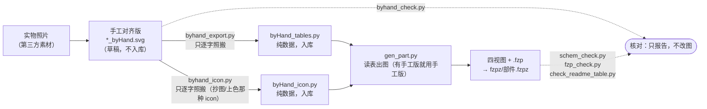
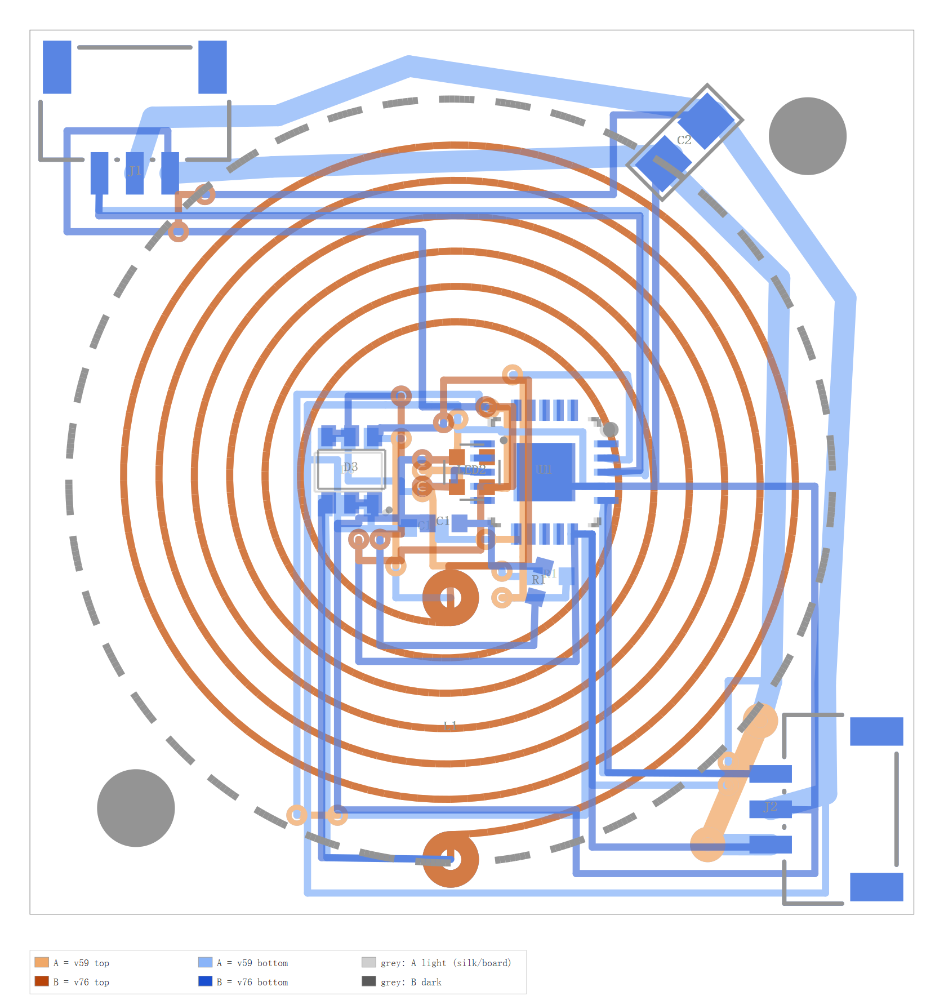

# `tools/` —— 元件开发辅助脚本（不参与打包）

## 为什么有这套东西（"照片对齐"工作流，用户 2026-09-15 定）

开发板/模组类元件的**面包板视图 = 整块实物板**，每个排针/元件的位置只能从实物照片量。
靠"目测象限摆位置"必然偏，所以改成：

1. **你在 Inkscape 里手工对齐**：把实物照片当底图，把排针/元件摆到照片上的实际位置，
   存成 `svg/<部件>/svg.breadboard.<部件>_breadboard_byHand.svg`
   （带照片、属草稿 → `.gitignore` 里已忽略 `*_byHand.svg`，不入库）
   ★ 这套流程**也用于 icon 视图**（2026-09-18 起，TX-AH-R900PNR 手画的模组顶视图）：
   `svg/<部件>/svg.icon.<部件>_icon_byHand.svg`
2. **导出成数据表**：`tools/byhand_export.py svg\<部件> [breadboard|icon]`
   （不写视图时先找 breadboard、再找 icon）
   → 生成 `svg/<部件>/byHand_tables.py`（纯数据，入库）
   ★ **一个部件两个视图都有手工版时**（TX-AH-R900PNR）：面包板那份另存
   `byHand_tables_breadboard.py`（规则见下面 2026-09-19 那节），icon 表名字不变。
   ★ **icon 手工版有两条路，按你“改的是什么”选**（2026-09-24 定，MX-1.25-3P-V 起）：
   · 改的是**版式/位置**（图形由元件拼出来的，如模组顶视图）→ 就用上面的
     `byhand_export.py … icon`：导出**结构化表**，位置变成数字，以后不开 Inkscape 也能挪 ✓
   · 改的是**形状/颜色**（icon 本身是抄厂商图纸 + 手工上色那种）→ 用
     `tools/byhand_icon.py svg\<部件>`：把图层**逐字**搬进 `svg/<部件>/byHand_icon.py`
     （`WIDTH_MM/HEIGHT_MM/VIEWBOX/INNER`），`gen_part.py` 原样搬进 `<g id="icon">`，
     **一笔不加工** —— 结构化重构会把手工调好的形状/颜色改掉 ✗
3. **生成器读表**：`gen_part.py` 里 `from byHand_tables import …`（icon 逐字版则是
   `from byHand_icon import INNER`）；以后要挪位置 = 改表里的数字（不用再开 Inkscape）

★ **手工版里常有嵌套 `group` + `transform`**（你在 Inkscape 里挪过元素）⇒ 取 `id="icon"`
图层时必须**按 `<g>` 标签配平扫描**；“非贪婪正则”只会截到第一个 `</g>` ✗
（面包板里嵌的那份也会跟着截断）。

之后这个部件就是**完全程序生成**的：`gen_part.py` 一跑，四视图 + `.fzp` + `.fzpz` 全部产出。

上面三步连起来就是这张图（实线 = 产出，虚线 = 核对；节点里的文件名就是仓库里那几份）：


```mermaid
flowchart LR
  P["实物照片<br/>（第三方素材）"] --> H["手工对齐版<br/>*_byHand.svg<br/>（草稿，不入库）"]
  H -->|"byhand_export.py<br/>只逐字照搬"| T["byHand_tables.py<br/>纯数据，入库"]
  H -->|"byhand_icon.py<br/>只逐字照搬（抄图/上色那种 icon）"| T2["byHand_icon.py<br/>纯数据，入库"]
  T --> G["gen_part.py<br/>读表出图（有手工版就用手工版）"]
  T2 --> G
  G --> O["四视图 + .fzp<br/>→ fzpz/部件.fzpz"]
  H -.->|"byhand_check.py"| C(["核对：只报告，不改图"])
  O -.->|"schem_check.py<br/>fzp_check.py<br/>check_readme_table.py"| C
```

**图里两个“看不见”的东西也在这条链上**：① 手工版带实物照片，所以**不入库**（只有导出出的
`byHand_tables.py` 进仓库）；② 核对工具是**独立**的 —— 它们只报告“差在哪”，不改图
（圆环与焊盘偏心这类问题要改**手工版**，见下面「约定」）。

## 待提给 Fritzing 上游的改进（TODO，2026-09-25 起）

> 立场：这些都是**成熟软件上的小摩擦**，不是"坑" ✗ —— 攒着，将来给 Fritzing 提 issue / PR 用 ✓。
> 每条都带**复现步骤**，可以直接贴进 issue 正文 ✓。

| # | 希望改进 | 现状 / 复现 | 出处 |
|---|---|---|---|
| 1 | **保存元件箱时保留"子分类"** | 子分类在我们生成的 `fzh_*.fzb` 里是 `<instance moduleIdRef="__spacer__" modelIndex="3" path="分类名"/>` ✓；在 Fritzing 里拖一个件 → 「保存元件箱」→ 重启 ⇒ **`__spacer__` 全没了、子分类消失** ✗（Fritzing 把 bin 整表重写 ✓）| 2026-09-25 实测 |
| 2 | **保存元件箱时别给实例补默认属性** | 同一操作后，每个 `<instance>` 被补上 `modelIndex="900126xx"` 与 `flippedSMD="true"` ✗（我们生成时没有 ✓）⇒ 脚本生成的 bin 被"改花" ✗ | 2026-09-25 |
| 3 | **插不进面包板时给一句原因** | 连接器引脚 `type="female"`（母）时，拖到面包板上**不吸附**、针脚落在两排孔之间 ✗，界面上看不出为什么 ✗。建议提示"该引脚是母的，面包板孔只能插公针" ✓ | 2026-09-25 |
| 4 | **支持 SVG 标准的 `dominant-baseline`** | 现在**不认**（cairosvg 也不认 ✗）⇒ 方框原理图的引脚名只能手动算基线偏移 ✓ | 长期 |
| 5 | **svg 尺寸写错时报错更明确** | ① 只写 `width` 缺 `height` ⇒ 弹「不能为 svg 创建渲染」✗（看不出是缺 `height` ✓）；② `schematic` 只写不带单位的数字 ⇒ 按默认 DPI 解释、尺寸超大 ✗（不报错 ✓）| 长期 |
| 6 | **面包板的孔不该在 PCB / 原理图视图里声明连接器** | 核心件 `breadboard2.fzp` 给**每个孔**都写了 `<pcbView><p layer="breadboardbreadboard" svgId="pin1A"/></pcbView>`（实测 831 条），且**原理图视图也有** ✗ ⇒ 面包板的 130 条孔 bus 会被塞进 **PCB / 原理图视图的网表** ✗（**看不见** ✗，因为 `breadboardbreadboard` 层在那些视图里不画 ✓）⇒ PCB 视图会报「还有 N 个连接件没布线」＋画鼠线虚线，而铜是通的 ✗。复现：任一张同时有面包板和 PCB 的草图 ⇒ 看 PCB 视图底栏（用户 2026-10-05 实测：报「2 个」✗）＋把面包板实例的 `pcbView`/`schematicView` 两段删掉 ⇒ 立刻「布线完成」✓。建议：面包板的孔**只在 `breadboardView` 里声明** ✓（像那些"只属于面包板视图"的件一样 ✓）。我们在下游的办法 = `tools/fz_deglue_views.py` ✓（另存不复发 ✓） |

**已经由我们这边解决的**（写在这里，免得误当上游问题 ✗）：面包板插孔要求引脚坐标落在
2.54 mm 网格上 + mm 尺寸换算 ✓、裸露焊盘命名与独立成网 ✓（都在 `AGENTS §5` ✓）。

## 脚本

| 脚本 | 干什么 |
|---|---|
| `byhand_export.py <部件目录> [breadboard\|icon]` | 手工版 → `byHand_tables.py`：嵌套 transform 累乘展开、单位统一成**内部单位**（100 = 2.54mm，**跟着文档的 width/height 走**，见下）、**`style=` 优先于同名属性**（CSS 规则）、**`SHAPES` 按文档次序**（保叠放）、按尺寸自动认图标（可用 `ICON_MATCH_BY_PART` 关）、丢掉照片与 Inkscape 壳、**隐藏图层整棵跳过**、多行文字按行拆、丝印统一字号（`FS_UNIFORM` / 大字规则 / 按部件关掉）、字重照搬、行距压紧（`LINE_PITCH`）、**`<path>` 照搬**（d + 累乘 matrix + 被引用的渐变）、焊盘（含**画成组**与**方形**）、圆角矩形的 `rx`（可选第 10 字段）、rect 的 `opacity`（可选第 11 字段）、导出 `PAD_R`/`PAD_SW`/`PAD_FILL`/`PAD_EDGE`/`DEFS`；**祖先组的 fill/stroke/stroke-width 会下发给缺失的后代**（2026-09-18）；目录名 ≠ 元件 id 时（如 `svg/TX-AH-R900PNR` 里文件都带 `_1`）按“本目录下该视图的手工版”兑底找 |
| `byhand_check.py <部件目录> [--png]` | 核对：元素计数（`text` 按**行**计）+ **加粗条数** + 每条文字的有效字号（能一眼看出整体缩放错）；`--png` 另出像素差与"左程序版 / 右手工版"对比图 |
| `byhand_icon.py <部件目录>` | **icon 专用的“逐字照搬”**（给“抄厂商图纸 + 手工上色”那种 icon 用，2026-09-24，MX-1.25-3P-V）：取 `<g id="icon">…</g>` 的**全部内容**（嵌套 group / transform / style 原样）+ `width/height/viewBox`，写成 `svg/<部件>/byHand_icon.py`（纯数据，入库）；Inkscape 的 `defs`/`sodipodi` 壳不带走。`gen_part.py` **有它就用它**（手工版优先，重跑不会覆盖你的改动）；与 `byhand_export.py … icon`（结构化表）的区别见上面「为什么有这套东西」 |
| `schem_check.py <部件目录> [--png] [--no-ccw]` | 核对**矩形符号原理图**（AGENTS §5）：① svg 头 width/height 齐不齐、viewBox 装不装得下 ② 每个脚 `connectorNpin`+`connectorNterminal` 齐不齐、端点是否落在引线末端 ③ 每脚一个编号（框外）+ 一个名（框内）、同字号 ④ **脚号逆时针连续**（沿 左→下→右→上 走一圈应是所有脚号的循环移位，且递增） |
| `fzp_check.py <部件目录> [--fzpz 包]` | 核对 `.fzp` ↔ 四个视图 svg：① 视图 `image=` 用**子目录路径** ② 每条 `svgId`/`terminalId` 在对应 svg 里真存在 ③ svg 里的 connector id 都被 .fzp 声明 ④ **svg 内 id 不重复** ⑤ `<buses>` 引用存在且不重复入总线 ⑥ **裸露焊盘（EPAD/EP）不许进任何总线**（独立成网、布线时特意接 GND，AGENTS §5）⑦ 面包板里同名焊盘必须在同一条总线里（NC/DNP 除外）⑧ `--fzpz` 包内**平铺**且成员齐全 |
| `sch_straighten.py <sketch.fz\|.fzz> [--apply\|--out <f>] [--tol-mm 0.25] [--view schematicView]` | **原理图后处理：把"本该横平竖直"的线拉直** ✓（2026-10-03 用户提议 ✓，起因 = 用户指着 `u270b_routed.fzz` 的 `C1` 段说「线不直」✗：那条竖直干线由 4 段拼成，其中 2 段各斜 **0.6721 单位 = 0.19 mm** ✗ —— `R1` 脚/横向线右端/地线都在 `x=161.3279` ✓，只有 `C1` 那一列在 `162.0` ✗；整图看不出、**一放大就露** ✗）。四条规则 ✓：**R1** 线端吸到它**声明**接的那只脚 ✓（✗ 只吸声明过的 ✗：靠近别的网不吸 ⇒ 否则会把"看着接上其实没接"变成"真接上" ✗✗）｜**R4** 同网端点归并（清浮点噪声 ✓）｜**R2** 近轴归正（一轴 ≤`TOL`、另一轴 ≥10× ⇒ 归零 ✓）｜**R3** 零件归列（两端都钉在脚上 ⇒ 是**零件摆偏了** ✗ ⇒ 按"哪端相遇的线多"定谁让谁 ✓，平移该零件 + 它的位号 + 挂在它脚上的线端 ✓）。四个**安全阀**（命中就只报不动 ✓）：对端是**脚位未知**的零件（核心库网标签/接地符号/via ✗）｜零件挂线的脚在目标轴上不一致（`U1` 那类多脚件 ✗）｜挂的线端是**结点** ✗｜两端份量相同（谁偏了只有人知道 ✓）。★ **默认只检查** ✓、`--apply` 才写（留 `.bak-straighten` ✓）、**`<connects>` 一个字不碰** ✓（条数变了或改出的 XML **解析不了** ⇒ **直接不写文件** ✗，两条都是踩出来的机器守 ✓）。★ 已在真实病例上对账 ✓：改前 正交度 **0.932**（最歪 0.1897 mm ✗）→ 改后 **0.977**（最歪 0.0377 mm ✓，只剩 `RC` 网标签那根 = 安全阀故意不动 ✓）。★ **已库化** ✓（2026-10-03 用户定）：`main(argv=None)` 守卫 ⇒ `import` **不再**执行命令行 ✓；`straighten_file(src, out=None, tol_mm=0.25, view="schematicView", apply=False, quiet=True) -> dict` ✓（`rc` / `changes` / `plan` / `skipped` / `v1_before` / `v1_after` / `still_slanted` / `wrote` / `out` / `text`）✓。★ 库化时**行为必须逐字不变** ✗ ⇒ 拿库化**前**跑出的 `.fz` 当基准、库化后再跑 **逐字节比对** ✓（实测**相同** ✓，比"我觉得没改坏"硬 ✓）。★ 库调用方会传 `pathlib.Path` ✓ ⇒ `load()`/`save()` 里先 `str()` ✓（✗ 第一版直接 `path + ".tmp"` ✗ ⇒ 传 `Path` 当场 `TypeError` ✗，是 notebook 用库 API 时撞出来的 ✓）|
| `sch_straighten_demo.ipynb` | 上面那个工具的**评估 notebook**（用户 2026-10-03 问"能不能入库 / 当后处理步骤"✓）：① 依赖与样例定位 ② 独立解析器把 sketch 读成**图**（节点 = 端点 ✓ 边 = 导线 ✓；有 `networkx` 就用 ✓）③ 跑工具（只检查 / `--out` ✓）④ 改前改后并排画图（有 `matplotlib` 就用 ✓，否则 PIL 降级 ✓）⑤ **自己量正交度** ✓（该横平竖直的分母 = 另一轴 ≥10× ✓；分子 = 偏差 ≤0.25mm ✓）⑥ 入库评估（结论 = **已入库 ✓ + 已库化 ✓**：`main(argv)` 守卫 + `straighten_file(...) -> dict` ✓；CLI 与库两种调法都演示并**互相对账** ✓）⑦ 流水线（复制 → 后处理 → **独立复核** ✓）⑧ 4 份真实草图批量跑 + 汇总 ✓。★ 它**故意自己写一份解析** ✓ —— 实测立刻抓出工具一个真 bug ✗：写回时"是否自闭合"那一格真假反了 ✗ ⇒ 漏 `/>` ⇒ 文件变**畸形 XML** ✗，而工具原来只比"声明表条数"✓、看不出这种坏 ✗ ⇒ 已加"先解析、解析不了不写" ✓（这就是"不许自证"的实际收益 ✓）。★ 本机没装 `matplotlib`/`networkx`/`ipykernel` ⇒ notebook 走 PIL/dict 降级路径 ✓（已按 8 格逐格跑通 ✓）|
| `sch_metrics.py <a.fzz> [<b.fzz> ...]` | **原理图量尺 = 独立实现** ✓（2026-10-03 入库 ✓）：导线数 / 元件数 / 总长(mm) / **交叉数** / **正交度** / 最歪(mm) ✓。★ 为什么要它 ✗：布线器（项目侧 `gen_schematic_wires.py` ✓）**自己会报**“交叉/贴脚/重叠” ✓ —— 但那是**它自己的口径** ✗；本仓规矩「不许自证」✗ ⇒ 结论必须能被**另一个实现**复核 ✓。口径写死在文件头 ✓：只认 `wireFlags & 128` ✓（面包板 64 / PCB 4 ✗）；正交度 = 已对齐 / 「本该横平竖直」（另一轴 ≥10× ✓）✓、对齐容差 0.25mm ✓；交叉 = **跨网**直线的 X（真穿 ✓）+ T（端点搭在别人内部 ✓）✓，**共端点不算** ✗。★ 实测一把就定方向 ✓：用户手画版 43 根/487.7mm/交叉 20 ✓（而自动布线同摆位 47 根/641.6mm/交叉 35 ✗）。库用法 `from sch_metrics import metrics; metrics(path) -> dict` ✓ |
| `sch_strip_wires.py <in.fzz> <out.fzz> [--dry]` | **剥掉原理图导线 ⇒ 「干净画布」** ✓（2026-10-03 入库 ✓）：项目侧布线器要的输入是**只有摆位、没有导线**的画布 ✓（它自己会画线 ✓）—— 想拿「**用户手调过的摆位**」去喂布线器（看它在人调过的摆位上画得怎么样 ✓），就得先把线剥掉 ✓。★ **只剥 `<schematicView>`** ✗、**不删实例本身** ✓：本板有些导线实例**同时**带面包板/PCB 视图 ✓（`layer="breadboardWire"` / `copper0trace` ✓）⇒ 整条删掉会把**面包板跳线和 PCB 走线一起削掉** ✗✗（实测踩过 ✓）；顺带删掉零件上指向导线的 `<connect … layer="schematicTrace"/>` ✓（实测 69 条 ✓ —— 留着就是「接在不存在的东西上」✗）。库用法 `from sch_strip_wires import strip_text / strip_file` ✓（`strip_text` 是**纯函数** ✓，好测 ✓）；剥完**先解析** ✓，解析不了**不写文件** ✗ |
| `copy_top.py <pdf> <out.svg> [<部件目录>/icon_art.py] [选项]` | 抄厂商 PDF 的**顶视图矢量**、可选剪掉多余脚位 ⇒ 出 SVG + 纯数据 `icon_art.py`（2026-09-24 用户定，MX-1.25-3P-V / PH-2.0-3P-V / SH-1.0-3P-V）。要点：① **标定比例**用 `--pitch`（脚距多少 pt）+ `--pitch-mm`（脚距多少 mm，默认 1.25 —— 1.0/2.0 系列必须显式给），并且**两个已知量互校**；② `--region` 必须把整套图**完全包住**；③ `--nocut` 原样照抄；④ 剪脚位**只剪脚位区**，两端的**卡耳不许裁**（AGENTS §10.11）；⑤ `--clip`：跨出区域的长线**按边界裁断保留** —— 图纸里「卡耳外缘」与「尺寸延长线」常是**同一条线**（PH2.0 立贴），整条丢就丢卡耳、整条留就带进尺寸线，只能裁断；⑥ `--drop x0,y0,x1,y1`（可多次）删掉完全落在该矩形内的图元，**裁断后的碎片也删** —— 清夹在脚位中间、区域躲不掉的尺寸线（SH1.0 立贴的 1.10/0.20）；⑦ `--stroke`/`--color` 重定线宽线色（图纸原线宽 ≈0.026mm，缩到 icon 就看不见，AGENTS §10.10）。被裁/被删的图元**逐条报出** ⇒ 必须核对「报出来的全是尺寸线」 |
| `check_readme_table.py` | 核对 **README「已有部件」表 ↔ `fzpz/`**（AGENTS §11 第 3/5 步的机器守，2026-09-24 —— 因 8 件元件"进了 `fzpz/`、进了元件箱，却漏登 README 表"而写）：① **漏登**（`fzpz/*.fzpz` 里 README 一个字都没提到的；支持 `fzpz/PB86-A0-*.fzpz` 这类**通配行**，也支持一行写多件；只写了名字、没写 `.fzpz` 后缀的**只提示、不算错**）② **写错**（表里写了但 `fzpz/` 里没有）③ **数量**（README 的「共 N 个元件」须等于 `make_preview.py` 的 `SHEETS` 条目总数、「N 个 `.fzpz`」须等于目录实测 —— 所以它**顺便守住了分组表与 README 的一致性**）。有问题退出码 1，可直接串进提交前检查 |
| `check_deploy.py [<部件>...] [--mine <dir>] [--fix] [--stray] [--clean-stray]` | **核对「仓库里的元件」与「Fritzing MINE 里装的那份」是否一致** ✓（AGENTS §10 清单第 2 步的机器守，2026-09-27 —— 因"35 件批量让半格"后我逐批报"已部署 ✓"，**独立再量一遍发现 34 件里 9 件根本没到位** ✗ 而写）。★ 它**不假设**命名，而是**从 fzp 自己声明的字段反推** ✓ MINE 该在哪：`moduleId` ⇒ `parts/user/<moduleId>.fzp`；`image="<view>/<名>.svg"` ⇒ `parts/svg/user/<view>/<名>.svg`（这条路径**才是 Fritzing 真正读的那份** ✗）。★ 判据分两层 ✓：**致命 ✗** = fzp 引用到的**图形文件不在那儿 / 是旧的**（写成 `.fzpz` 内部名 `svg.breadboard.*.svg` 就落到这一类 ✗）、fzp 本身旧/缺；**提示（不算 ✗）** = fzp **文件名**与 `moduleId` 不一致 —— Fritzing **自己导入 `.fzpz` 时也会改名** ✓（实测 `SYB-118.fzp` 的 moduleId 是 `Breadboard-SYB118-ModuleID` ✗ 却在正常使用 ✓），一律判错会**误报** ✗。逐条报出**仓库 / MINE 的 mtime**（谁更新一目了然 ✓）。`--fix` 照仓库写到**正确路径** ✓（★ 覆盖前**自动备份**被覆盖的那份到 parts 之外的 `_deploy_backup_<时间戳>/` ✓ —— MINE 是**用户的** Fritzing 目录 ⇒ 必须留后路 ✗）；`--diff` 先把「旧」的**实际差异**打出来 ✓（同步前先看清谁改了什么，别把用户在 Fritzing 里改过的东西冲掉 ✗）；`--clean-stray` 把 `.fzpz` 内部名的残留**移到 parts 之外的备份目录** ✓（**不删** ✗）。退出码 0/1 |
| `svg_lines.py` | `tools/` 内部共用小工具：把 `<text>` 拆成**行**（Inkscape 多行 = 同个 `<text>` 里多个 `role="line"` 的 tspan）；导出与核对**共用这一份口径**，否则一个按行、一个按整段，核对表会冒假差异 |
| `make_preview.py` | 生成 **README 用的元件预览拼图**（`docs/preview/<组>.svg`；AGENTS §9 图文并茂）：内容 = 各部件自己的 `svg.icon.*_icon.svg`，**不手绘、不复制几何**，改完 icon 重跑即刷新。三个不显然处：① 每格用**嵌套 `<svg viewBox>`** 当视口等比装框（源 icon 坐标有 mm / 老 px / Inkscape 三种单位，写 transform 必算错）；② `id` 与 `<style>` 选择器**逐格加前缀**（拼图是一个文档，id/CSS 是文档级，不加就串色）；③ 清 Inkscape 壳（`<sodipodi:namedview>`、`<inkscape:path-effect>` **元素**、命名空间属性）后用 `ET.fromstring` 自检 —— 漏清元素会 `unbound prefix` 整张炸。格下尺寸**只在 icon 写了带单位 width/height 时才标**（老件是无单位视觉比例，标了就是假数字）。分组清单在脚本的 `SHEETS`；`--list` 只看不写 |
| `make_fzb.py` | 把 `make_preview.py` 的**同一份分组**写成 **Fritzing 元件箱**（`<用户目录>/Documents/Fritzing/bins/fzh_*.fzb`）—— 重启 Fritzing 即多出这 6 个箱，不用在界面上一个个点。机制（已核对 1.0.3b 源码）：Fritzing 启动时**扫该目录全部 `*.fzb`**、每个文件一个箱（`binmanager.cpp` 的 `findBins(userBinsDir,…)`）；格式照 `my_parts.fzb`，但**每条 `<instance>` 必须带 `<views/>`**（`modelbase.cpp`：`do not load a part with no views` —— 少了它箱是空的）、`modelIndex` 不写（那是保存时的运行时编号）。**箱图标是最容易踩的一处**（踩了两次，两次现象不同）：`icon=` 有两条分支 —— ① 内嵌 SVG 文本（`isCustomSvg()`：以 `<?xml` 开头且含 `<title>Fritzing Custom Icon</title>`）：能显示，但 `m_monoIcon` 被**写死**成内置 `Custom1-mono.png`（黑六边形），而标签栏画的正是 mono 图标 → **未选中的箱全变黑六边形**；② 文件名：Fritzing 先在**箱文件同目录**找 `<名字>.png`，再找同名 `<名字>-mono.png`（`path.insert(ix, "-mono")`）。所以本工具走 ②：给每组渲 `fzh_<组>.png` + `fzh_<组>-mono.png`（同一张彩图 —— Fritzing 只要求文件名带 `-mono`，没要求真·单色）。图标内容 = 每组代表零件**自己的 icon 几何**缩进 64×64（改哪组用哪个零件看脚本里的 `BIN_ICON_OF`），渲染用 cairosvg（与 `byhand_check.py` 同一套依赖）。**箱内能分小节**（像自带 CORE 的「基本/输入/输出」）：插一条 `moduleIdRef="__spacer__"` 实例，**文字就是它的 `path`**，spacer 也要带 `<views>`（`modelbase.cpp` 把它建成 `ModelPart::Space`，`setInstanceText(path)`）—— 小节表在脚本的 `SECTIONS`，**必须恰好盖住该组全部条目**（漏/重/写错名字就报错，不静默丢）。匹配已装零件按 moduleId→去 hash→去尾号→归一化名级联，命中规则用 `--verbose` 逐条看；`--list` 只报告不写；`--verify` 单独自检已有箱（写完也会自动自检一次：`<views/>` 齐不齐、`path` 真存在、`moduleIdRef` 与 `.fzp` 声明一致 —— 这三条都是“不报错但箱是空的”那种失效）。**只写自己的 `fzh_*.fzb`**，不动 `my_parts.fzb`/别人的箱。默认还会**镜像一份到仓库 `fzb/`**（`--no-mirror` 关掉）：主输出必须在 `<Documents>/Fritzing/bins`（Fritzing 只读那里），仓库那份仅归档/审阅，整目录拷回 Fritzing 目录即可恢复（里面是本机绝对路径，换机无效） |
| `../svg/<部件>/trace_photo.py` | 把实物照片按卡尺比例叠到我们图上，用来判断"哪块偏了多少"（照片不进仓库） |

| `bb_compare.py <a.fzz> <b.fzz>` | **面包板布局的度量尺**（在 `AuroraTessellation-NFC` 像素板项目里长出来，2026-09-27 收进库）：列**长度 / 段数 / 用孔数**，以及用户判据里的**「交集」= 交叉(X) + 搭线(T 形) + 穿元件** —— 三类各算 **1 次**（只数 X 会低估：同一张图实测 9 → 3）；另供 `pair_kind` / `obscures` / `hole_xy` 给其它工具**共用同一份几何**（防"两套实现各算各的、数字对不上"）|
| `part_box.py` | **元件几何**（同上收进库）：`canvas_mm`（画布尺寸→mm；★ `px` = **1/72 英寸**，不是 1/96 —— 按 96 算本体小 25%，实测"被 1010 板遮住的孔"因此漏判）、`body_box`（本体包围盒；内容跑到画布外时照实返回，不再罢工）、`place`（按实例矩阵搬到 sketch 绝对坐标）、`resolve_svg`（按 fzp 的 `breadboardView/layers@image` 找真 svg）、`pin_points`（引脚参考点，走完整祖先 `transform` 链：焊盘组的 `translate` 差 **200** 与组内 `x` 差 **−186** 会**互抵**，真脚距只有 **14.4**；有 `legId` 时取**腿尖**，core 件的连接点在腿上、不在 pad 标记上）|
| `diag_pair.py <fzz> <孔A> <孔B> [--drop Wire…] [--top N]` | **"这对孔到底能不能画成折线"的独立量尺**（2026-09-27 用户追问"你的问题在只会画斜线吧？"时长出来；**只读** ✓）：枚举 **直 / L / Z（偏移加密到 4.5 单位）/ 绕框 U 形**全部候选，逐条报【真实长 / 形状加权长 / 交集 / 成本】或**被哪条规则拒**（①自交 ②碰本体 ③重叠 ④盖住接线孔）。用途：把"生成器为何没选那条更好的走法"变成可读的数字 —— 实测 v62 的 5V `pin32C→pin47Y`：折线 68.6mm/交集 0 ⇒ 75.4 vs 斜线 73.2 ⇒ **只差 2.2** ⇒ 结论是"有折线、只是排序键让斜线赢了" ✓（不是几何上没路 ✗）。★ 判据与 `bb_compare` 同源 ✓（`pair_kind` / `seg_hits_box` / `obscures` / `hole_xy` ✓）、本体框与生成器同源 ✓（`part_box.body_box` + `place` ✓）；★ `seg_hits_box` **擦到框边也算碰** ✓（贴着模块边缘走会被拒 ✗ —— 手算采样验过：严格在框内 **0 点** ✓，是'物理上贴着外壳'的口径 ✓）；★ 唯一**抄**来的是 `shape_factor`（斜线罚 1.5 ✓，抄在脚本里并标了出处 ✗，只为对照 ✓）|
| `audit_silk_on_board.py [<breadboard.svg>...] [--all]` | **绿转接板上丝印文字是否落在板内** ✓（2026-09-27 用户发现「引脚数字是丝印在板上的，现在漂浮在空中了」✗ 后写的）。★ 为什么会有这个病 ✗：批量"板边让半格"把板**缩小**了 50 单位/边 ✓，而数字还写在老位置 ✗ ⇒ **漂到板外** ✗ —— 板"让半格"是为了不挡板外的孔 ✓，但**板上的丝印必须跟着板走** ✓，这条原来**没有机器守** ✗ ⇒ 8 件带着病过了 10 批提交、肉眼也没看出来 ✗。逐个 `<text>` 估包围盒（字号、`text-anchor`、`dominant-baseline`、祖先/自身 `transform` 全算 ✓）⇒ 报"整块在板外/跨板边" ✓。★ 踩过：`font-size` **属性**写法（值是裸数字、没有 `font-size:` 前缀 ✗）一开始没认 ✗ ⇒ 回退默认 12 ⇒ 写在 `scale(39.37)` 组里的芯片丝印被算成 **1984 单位宽** ✗ ⇒ 凭空冒出 3 件**误报** ✗（改准后消除 ✓）。★ 判据用 `part_box.apply` 走完整 transform 链 ✓（与其它工具同一个口径 ✓）。 |
| `audit_green_board.py [仓根]` | **绿转接板相位审计**（2026-09-27 用户立规则时长出来 ✓）：新规矩（AGENTS §3b）—— **转接板不许影响「板外」孔的插拔** ✓ ⇒ 板边**正好压在孔行/孔列线上** ✗ 就会把那一排孔压掉一半（插不进线 ✗）。工具取该元件 `connector*pin`/`*leg` 的**中心**当基准线 ✓，量四条板边到最近基准线的距离 ⇒ 合格值 = **半格（离孔心 1.27mm）** ✓。★ 判据**必须锚在针脚上** ✗ —— 第一版写成"板的宽高是不是 2.54mm 的整数倍" ✗，那是错的 ✓（针脚本就不在板的整数格上）。现状：**36 个绿板件里 35 个违规** ✗（历史习惯把板做成整数格 ✗）|
| `bb_phase_raw.py <breadboard.svg>` | **看"未折叠"的板边相位** ✓（2026-09-27 ✓）：`audit_green_board.py` 报的是**折叠后**的相位 ✗（`min(d, 9−d)`）⇒ 看不出 0.28 到底是"差 0.28"还是"差 8.72" ✗，而补半格**要按方向挪** ✓。这个探针把四条边与**最近针脚线**的有符号偏移（草图单位 ✓）打出来，并给出"挪到半格 ±4.5 取小者"的建议 ✓。★ 它用 `viewBox` 原点做换算（原点必须减掉 ✓）；`FPC05-2H10PX` 就是靠它暴露"画布被整体上移过、绿板比画布还大" ✗ 这个反常情形的 ✓ |
| `check_inside_board.py <breadboard.svg> ...` | **改板边后必查** ✓（2026-09-27 ✓）：绿板（`fill=#00aa44` 的矩形）算板 ✓、其余图元的合并包围盒算本体 ✓（含 transform ✓）⇒ 报“本体是否还在板框内 ✓ + 四边余量（内部单位 ✓）”。用途：挪板边最容易出的错就是**把本体切到板外** ✗（板变小了、本体还在原处 ✗），这个探针一眼看出来 ✓ |
| `bb_inset.py <部件目录> [--dry]` | **给绿板元件加“板边让半格”的受限 codemod** ✓（2026-09-27 ✓，配合 AGENTS §3b 新规矩）：只认**精确写法**的板框 rect ✓，把它的几何换成四周各让 50（半格）✓ 并在 **模块 docstring 之后**插入 `INSET = 50` ✓；认不出就**报出来、一个字不动** ✗。★ 两个踩过的坑 ✓：① 插在“第一个空行”会插进 docstring 里 ✗ ⇒ 运行到板框直接 NameError ✗ ⇒ 改用 `ast` 找 docstring 结束行 ✓；② 曾支持 `%` 版写法 ✗ ⇒ LD1117 上生成器当场 `TypeError` ✗（几何改了、参数表没跟上 ✗）⇒ 该变体**已删除** ✓，这类件人工改 ✓。★ 改完必跑 `audit_green_board.py` + `check_inside_board.py` ✓ |
| `bb_legend3.py <sketch> <out> <x> <y> <行距> <首行偏移> <文字偏移> <模板.fzz>` | 往 sketch 的面包板视图里写**图例**（标题 + 每网一行：色条 + 网名；颜色取导线自己的 `wireExtras/@color`）；先清掉旧图例（文字件 + 色条）⇒ 可以反复重跑 |
| `bb_diag_list.py <fzz> [--color '#rrggbb']` | **斜线清单**（2026-09-27 入库）：把“斜线多不多”从一个**数字**变成一份**名单** —— 默认列全图**每一条**斜线（哪根线 / 哪一段 / 多长 / 在哪两个孔之间），加 `--color` 则打印该颜色那根线的**逐段几何**（水平/垂直/斜线 + mm）。用法实测：对着用户手画的 `*_byHand.fzz` **逐条比对** ⇒ 才能回答“为什么没像我这样画”；也用来验“降斜线系数后斜线 1→9 条 ✗ / 变 0 条 ✗ / 4 条 ✓”。★ “是不是斜线”的容差与 `bb_compare` **同一个值**（0.25 单位，滤掉手绘抖动） |
| `bb_col_probe.py <fzz> <列…>` | **某几列孔上插了什么元件脚**（2026-09-27 入库）：看电气拓扑用 —— 回答“这个网为什么能这样接”。实测用途：用户手版把 GND 从 `pin13A→pin13X`（col13 拉到 X 轨 ✗ 7.6mm）改成 `pin12D→pin13D`（搭隔壁 col12 ✓ 2.5mm），跑一遍就看出 **D3 的两个地脚正好分在 col12/col13** 而 col12 本已接地 ⇒ 这一手电气等价且省 5.1mm |
| `file_sanity.py <sketch.fzz>` | sketch **文件级自检**：① 导线颜色必须来自 Fritzing 官方色表（表外 hex **画得对、但指示栏认不出、回退成"蓝"**，实测过）② 零长线 ③ 非法属性 ⇒ 有问题退出码 1 |
| `fix_connects.py <in.fzz> <out.fzz>` | 清**悬空 `<connect>` 记录**：删了导线/元件之后，孔上"接在已不存在的实例上"的记录还在 ⇒ Fritzing 里那些孔悬停时一片亮（实测我生成的版本各 12 处、用户手画版 0 处）⇒ 交付前清掉 |
| `pcb_pads.py <sketch.fzz> [--part <位号>] [--spec]` | **读元件 PCB 焊盘几何**（2026-09-30 立 = PCB 自动化地基 ✓）：connector 清单来自 `.fzp` ✓、焊盘图形 = pcb svg 里 id 为 `<connectorN><后缀>`（`pad`/`pin`/`leg`… ✓）、**在哪层**看它所在的 `<g id="copper0\|copper1">` ✓、位置走完整 `transform` 链 ✓（复用 `part_box` ✓，不另写一份 ✗）。`--spec` = 与已知 land pattern 的**对账**（出处写在表里 ✓；FAIL = 查清谁错了 ✗ 不是改期望值凑过 ✗）：本项目实测 QFN20 **0.400** ✓、SOT-363 **0.650** ✓、1010 **0.850** ✓、SH1.0 **1.000** ✓、线圈两端 **7.400** ✓、core 0603 **1.700** ✓（**R 与 C 共用同一个 `pcb/SMD_0603.svg`** ✓）。★ 另报"**没人认领的铜**"（无 connector id 的矩形/圆 ✓，如 SH-1.0-3P-V 的 2 块锚定焊盘 ✓）⇒ 布线必须当障碍 ✓ |
| `pcb_wire.py <sketch.fzz> [--dump] [--roundtrip]` | **PCB 走线 / 过孔的写法**（2026-09-30 立）：`<pcbView layer="copper0trace\|copper1trace">` ＋ `<geometry z x y x1 y1 x2 y2 wireFlags/>`，★ **绝对端点 = (x+x1, y+y1)** ✓（`x,y` = 线自己的 loc ✓、`x1..y2` = **相对偏移** ✗ —— 这正是〈挪完件冒出远处垃圾走线〉的根因 ✓）；过孔 = `ViaModuleID` ＋ `<pcbView layer="copper0">` 的一个点 ✓。`--roundtrip` 守 **数字格式 = `%.6g`**（= `QString::number(double)` ✓）：Fritzing 自己写的 `single-channel.fzz` **248/248 实例逐字节相同** ✓✓；★ 顺带发现**我们自己的生成器写 `108.0000`** ✗ ≠ Fritzing 的 `108` ✓ ⇒ PCB 生成器一律用 `%.6g` ✓、**已交付的面包板/原理图不动** ✗。`--dump` 还报"走线端点在不在**板框内**"：实测 `single-channel` 105 条中 **24 内 / 186 外** ✗、`pixel.fzz` **5 内 / 55 外** ✗ ⇒ 那些"PCB 走线"只是**从面包板搬过来的坐标** ✓（总长 2909 mm 塞不进 43×24 的板 ✗）⇒ 两个仓里**没有一个 sketch 真的在 PCB 上布过线** ✗ |
| `pcb_check.py <sketch.fzz> [--nets=<项目数据.py>]` | **PCB 读回校验器**（= PCB 版的 `check_netlist` ✓，2026-09-30 立）：把 pcbView 读成**几何** ⇒ 五查 ✓ ①悬空端点 ②板外 ③孤立过孔 ④**同层交叉/重叠 = 短接** ✗ ⑤**连通性 == 网表** ✓（几何接触 ⇒ 并查集 ✓，**与 Fritzing 记的 `<connects>` 无关** ✓ ⇒ 不跟生成器共用世界模型 ✓ 不许自证 ✓；短接会自动在 ⑤ 现身 ✓）。★ 通孔盘按"**贯通两层**"算 ✓，并把"只画了一层"另行提示 ✓（不静默 ✗）。★ **负例自测**（每条判据都要能被坏例子打出来 ✓）：`pixel.fzz` ①46/②55/④16/⑤9 ✓；`single-channel.fzz` ①123/②186/③10/④82/⑤25 ✓（**五类全中** ✓）；我方尚未布线的 `pixel-breadboard104.fzz` 只有 ⑤9（九个网全没连 ✓）= 干净基线 ✓ |
| `fz_deglue_views.py <in.fzz> <out.fzz> \| <in.fzz> --check` | **去粘：让"面包板"不进入 PCB / 原理图视图** ✓（2026-10-05 用户实测三视图确认 ✓；机理全文见 `docs/fritzing-fz-notes.md` §10 ✓）。★ **病** ✗：同一草图里既有面包板、又有 PCB 时，**PCB 视图报「还有 N 个连接件没布线」＋画鼠线虚线** ✗，而铜其实是通的 ✓（消融实验：把面包板整个删掉 ⇒ 立刻"布线完成" ✓）。★ **机理** ✓（读源码 ✓）：① 核心面包板件给**每个孔**都声明了 `<pcbView><p layer="breadboardbreadboard" svgId="pin1A"/></pcbView>`（实测 `breadboard2.fzp` 里 **831 条** ✓）⇒ **面包板的孔在 PCB 视图里也有连接器项** ✗（看不见 ✗ 但进网表 ✓）；② 恢复记录时目标项走 `ItemBase::findConnectorItemWithSharedID()`（=`connector->connectorItem(m_viewID)` ✓）⇒ **只在当前视图里找** ✓（`handleConnect()` ✓）；③ ⇒ 面包板 `pcbView` 段里那些 `pin14F → U1(…) layer=copper0` 记录在 **PCB 视图里是"真"连接** ✗ ⇒ 面包板内部 **130 条 bus** 把 PCB 的网**并掉** ✗。★ **修法** ✓：`sketchwidget.cpp` 加载逻辑 `if (view.isNull()) continue;` ⇒ **该视图没有段落 ⇒ 该视图里根本不创建这个元件** ✓ ⇒ ① 面包板类实例**整段删掉** `<pcbView>`/`<schematicView>`（连 geometry 一起 ✓）② 别的实例在这两段里删掉跨视图记录 ✓；**面包板视图一个字不动** ✓（自检：段**逐字节相同** ✓、插件 44 / 跳线 37 / bus 130 **不变** ✓）。★ **只删记录不稳** ✗：连接报在 **Connector 级**（`Connector::connectTo()` ✓）⇒ 下次 Fritzing 另存会把各视图记录**再写回来** ✗；且记录是**双向**的 ✓ ⇒ 只删"零件 → 面包板"那一半**一点用都没有** ✗（实测仍报 2 个 ✗ —— 第一版就栽在这 ✓）。★ `--check` = **独立只读复核** ✓（面包板类实例有这两个视图段 ⇒ 报 ✗；pcbView/schematicView 里有跨视图记录 ⇒ 报 ✗；退出码 0/1 ⇒ 可串进提交前检查 ✓）：实测改前 `pixel-pcb-v67.fzz` 报 **86** 条 ✗、改后 **0** 条 ✓。★ **已知残留** ✗：via/导线在**面包板段 / 原理图段**里还留着 **77 条**同族残留（源层写成 `copper0` ✗，不并网 ✓）⇒ `sym.py`（项目侧）因此报 21 条"单向残缺" ✗ ⇒ 待清 ✓ |
| `breadboard_only_views.py <部件目录> [--do] [--pack]` | **让面包板件的“孔”只在面包板视图里声明** ✓（2026-10-05 用户定，`SYB-118` 起；机理＝`docs/fritzing-fz-notes.md` §10 ✓）。★ **病** ✗：面包板每个孔若在 `schematicView`/`pcbView` 里也声明连接器，那两个视图就会给孔**建连接器项** ⇒ 上百条孔 bus 被塞进**那个视图的网表** ✗（**看不见** ✗）⇒ Fritzing 状态栏假报「还有 N 个连接件没布线」✗ ＋ 画鼠线 ✗。本库 `SYB-118` 实测 **690 孔 × 2 视图 = 1380 块** ✗（`fzp_check` 当时因此报 **1380 条**“svgId 在 schematic/pcb 视图 svg 里找不到”✗ ⇒ 改完只剩 **10 条** ✓，**全是既有的**打包/总线问题 ✓，**一条没多** ✓）。★ **只改孔** ✓：部件级 `<views>` 四条**全保留** ✓（部件结构正常 ✓、Fritzing 不会当它是“残件” ✗）；孔的 `breadboardView` 块（`type=female` ＋ `svgId`）**逐字不变** ✓。★ 安全阀 ✓：只认 `family=Breadboard` ✓（别的件直接拒 ✗）；`--do` 前留 `.bak-onlyviews` ✓；改完**必须**自己解析 ✓ 且 connector 数 / `<buses>` / 面包板视图块 / 部件级 `<views>` **四样逐字不变** ✓，任一条不满足就**不写** ✗；`--pack` 顺手重打 `fzpz/<名>.fzpz` ✓ 并核对“包内文本 == 磁盘” ✓ |
| `pcb_metrics.py <a.fzz> [<b.fzz> ...] [--nets=<项目数据.py>] [--worst=N]` | **PCB 走线量尺 = 独立实现** ✓（2026-10-05 入库 ✓；对应原理图那把 `sch_metrics.py` ✓，起因＝用户问"根据我的手画版本能提炼什么规则 ✓、能继续改进自动布线吗" ✓）。量：**走线段数 / 总长（mm，按层 ✓）/ 过孔数** ✓；**线段角度分布**（0/45/90/其它 ✓）；**拐角分布**（同层共端点的两段之间的转角 ✓，0° = 直着走 ✓）；并给**点名单**（前 N 条非 0/45/90 的线与拐角 ✓ —— 数字只说明多不多 ✓，名单才是抓手 ✓）。★ 口径写在文件头 ✓：全部**从文件几何算** ✓，与布线器的成本函数**无关** ✗（本仓"不许自证" ✓）。★ **间距/短接不在这里** ✗ —— 那是 `pcb_check.py` 的活 ✓，别抄第二份 ✗。★ 实测立刻推翻两个想当然 ✓：① 用户那份 `pixel-pcb-v65/66/67_byHand` 与我的自动版**几乎逐段相同** ✓（94 vs 95 段、234.5 vs 234.6 mm、过孔都是 16 ✓）⇒ 那些 `_byHand` 是"**在我布线上二次编辑**" ✗、不是他自己布线 ✓；② 他**真正手布**的 `pixel-pcb-v51_byHand`（25 段 / 81.3 mm / 2 过孔 ✓）里 **16/25 段不是 0/45/90** ✗ ⇒ "PCB 只走 45/90"这个假设**不成立** ✗ |

## Fritzing sketch 坐标语义（2026-09-26 从源码取证 ✓）

写/读 `.fz` 时**必须**知道这四条 —— 踩过的坑：**把导线的局部坐标当成绝对坐标** ✗，
于是四套单位假设全都自相矛盾 ✗，白试了好几轮 ✗（用户提示"源码在 `F:\build-fritzing`"后，
**两处源码 + 一次实测**就全通了 ✓）。

| 量 | 事实 | 出处 |
|---|---|---|
| **坐标单位** | **1 单位 = 1/90 英寸 = 11.111 mil = 0.2822 mm** ⇒ 网格 `0.1in` = **9 单位**（2.54 mm = 9 单位 ✓）| `src/utils/graphicsutils.h`：`SVGDPI = 90`、`StandardFritzingDPI = 1000`、`IllustratorDPI = 72`；`pixels2mils(p, dpi) = p*1000/dpi` |
| **svg 单位 → sketch** | `px` → ×1 ✓、`mm` → ×3.5433 ✓、`in` → ×90 ✓ | 同上（`px` 就是按 `SVGDPI` 算的 ✓）|
| **元件位置** | `<XView><geometry x y z/></geometry>` 里的 `x,y` = 元件的 `loc` ✓ | `ItemBase::saveInstanceLocation` |
| **导线** | `<XView><geometry x y x1 y1 x2 y2 wireFlags/>` —— `x,y` 是**导线自己的 loc**，`x1..y2` 是**局部线段** ✗；**绝对端点 = loc + (x1,y1) / loc + (x2,y2)** ✓。Fritzing 自己写的是 `loc = 一端` ＋ `局部 = (0,0)→Δ` ✓ | `src/items/wire.cpp` `Wire::saveInstanceLocation`（约 846 行）|
| **连接** | 存在**连接器级** ✓：`<XView><connectors><connector connectorId="…"><connects><connect connectorId="对方的脚" modelIndex="对方实例" layer="…"/></connects></connector></connectors>`；**视图级 `<connects>` 是旧格式、Fritzing 1.0 不读** ✗ —— 只写它 = **看着连上其实没连** ✗（现象：点网络不高亮 ✗ + 线端空心圆 ✗）。`layer` = **对方**的层次 ✓：`schematic`（元件/网标签 ✓）、`schematicTrace`（原理图导线 ✓）、`breadboardbreadboard`（面包板孔位 ✓，正常写法、与原理图无关 ✓）。连接**两端各记一份** ✓ | 实测取证：用户自己的 `single-channel.fzz` + `NetLabel-Pad` 实例（2026-09-26 ✓）|

★ 教训：**与其从数据里"反推"格式，不如直接读源码** ✓ —— 反推容易"越试越乱" ✗（正是 `AGENTS §0` 说的过拟合信号 ✓）。

### Fritzing 命令行导出 SVG（`-svg`，2026-09-26 研究 ✓）

**参数是「工作目录」，不是输出文件** ✓ —— 而且**要导出的 `.fzz` 必须放在那个目录里** ✗✓
（名字 `m_outputFolder` 是误导 ✗）：

```powershell
# 把 sketch 放进 $work，然后只给目录
& "$env:LOCALAPPDATA\Programs\Fritzing\Fritzing.exe" -svg $work
# ⇒ 目录里出现 <名字>_breadboard.svg / _schematic.svg / _pcb.svg
```

出处：`src/fapplication.cpp` —— `-svg`（字符串参数）置 `ServiceType::SvgService` 且
`m_outputFolder = m_arguments[i + 1]`（约 487 行）；`runServiceAux()`（993 行）起手就是
`QDir dir(m_outputFolder); … dir.entryList(filters, QDir::Files)` ⇒ **sketch 从该目录里找** ✓；
`runDRCService` / `runGedaService`（1158、1187 行）同为这个写法 ✓。

⚠️ **实测：本机这个构建不产出** ✗（`exit 0`、目录里只有原来的 `.fzz` ✗）——
换成**已知完好**的 sketch 也一样 ✗ ⇒ **不是输入文件的问题** ✗，是服务在这个环境里静默失败 ✗
（要拿 SVG 当"眼睛"看渲染结果时，仍走**手工**：Fritzing 里 `File ▸ Export ▸ as Image ▸ SVG` ✓）。
⇒ 记在这里，免得以后再花一轮去研究它 ✗。

### 量元件 / 量引脚（两个取证小工具，2026-09-26 入库 ✓）

| 工具 | 干什么 |
|---|---|
| `part_measure.py <sketch.fzz> [-o 报告.txt]` | 量每个元件的**原理图尺寸**：`part.<moduleIdRef>.fzp` → `schematicView/layers/@image` → 元件 svg 的 `width/height/viewBox` ✓；再与 sketch 里的"线端 − 锚点"相除 = **比例**（各轴、各对引脚都该得同一个数 ✓，对不上就是量错了 ✗） |
| `pin_ruler.py <sketch.fzz> <Fritzing导出的.svg>` | 拿 Fritzing **自己导出**的 SVG 当尺子 ⇒ 累乘 `<g>` 的 `transform` 算出每个实例坐标 → 导出坐标的映射 ✓，再用**同一型号的两个实例**联立解全局比例、用**其余实例校验** ✓（实测比例 **1.25**、离散度 **0.0000%** ✓）；脚位置 = `loc + 1.25×(脚导出 − 绘图原点导出)` ✓ |

两个都**只量、不改** ✓，也不写死本机路径 ✓（元件 svg 靠 sketch 里的 `path=` 属性找 ✓，找不到就报 "?" ✗ 不猜 ✓）。
它们是「按坐标画线」那类脚本的地基 ✓ —— 例：本项目里生成 `pixel_wired.fzz` 的 `wire_build.py` ✓
（已知局限：库里的**旧式符号**（如 1010）量出来与 core 不同 ✗ ⇒ 只有 core 量得准 ✓）。

### `recal_pins.py <我的.fzz> <Fritzing导出的.svg>`（2026-09-26 入库 ✓）

**跨元件**的「sketch 坐标 ↔ 导出坐标」换算，**必须**反推自 Fritzing 自己的渲染 ✓：

| 事实 | 说明 |
|---|---|
| 映射是**一个全局仿射** ✓ | `导出 = s·sketch + A`，`s` 实测 **0.800000**（= 1/1.25 ✓），残差 **0.0000** ✓ |
| ✗ **不许**用"逐元件公式" | `sketch = loc + 1.25×(导出 − 该元件绘图原点)` 只在**单个元件内部**自洽 ✗，跨元件不成立 ⇒ 线端与脚端**错开** ✗（用户 2026-09-26 实测截图指出 ✓）|
| `A` 跟**每次导出的画布范围**有关 ✓ | 同一个 sketch，内容不同 ⇒ 导出的平移不同 ⇒ 标定必须针对**当次导出** ✓（拿旧导出标定新导出会整体偏 ✓）|
| 做法 | 我写的导线在 sketch 里的端点**我知道** ✓、Fritzing 把每根线渲染成"只含一条 `<line>` 的组" ✓ ⇒ 一一对应最小二乘拟合 ✓，残差即自检 ✓；再 `sketch = (导出 − A)/s` 反推每个脚 ✓ |

### `wireFlags` 是**位标**，原理图与面包板不同（2026-09-26 入库 ✓）

`src/viewgeometry.h:42`：

```cpp
enum WireFlag { NoFlag=0, RoutedFlag=2, PCBTraceFlag=4, ObsoleteJumperFlag=8,
                RatsnestFlag=16, AutoroutableFlag=32, NormalFlag=64,   // ← 面包板导线
                SchematicTraceFlag=128 };                            // ← **原理图导线**
```

- 原理图视图的 trace flag = **128** ✓（`schematicsketchwidget.cpp:358`）；面包板导线是 **64** ✓。
- ★ 少了 128 那一位 ✗，`modelbase.cpp` 的 `checkOldSchematics()` 会把线当"**旧版导线**" ⇒
  **不算布线** ✗ ⇒ Fritzing 里画成**虚线**、状态栏提示"仍有 N 个插接件需要布线" ✗
  （2026-09-26 用户截图发现 ✓）。
- ⚠ 导线实例是**从原文件克隆**来的（模板往往是**面包板**导线 ⇒ `wireFlags="64"` ✗）⇒
  **必须显式改成 128** ✓ 不能照抄 ✓。

### `.fzp` 里的 `<buses>`：文件里长什么样（2026-09-26 用户提示后补记 ✓）

**元件内部**「哪些脚本来就互通」就写在 `.fzp` 的 `<buses>` 里 ✓ —— 写元件时我们天天用它
（`AGENTS §3`：GND/3V3 等互通、`AGENTS §5`：同一元件多焊盘各自独立 connector + `<buses>` 互联 ✓），
但**它的文本形态**一直没记下来 ✗ ⇒ 读面包板零件时靠猜字段名 ✗，连错两轮 ✓。

| 事实 | 说明 |
|---|---|
| 元素名 | **`<buses>`**（里面每条 `<bus>` ✓）。★ 成员写法**不一定是** `<member connectorId=…>` ✗ |
| **稳健读法** ✓ | 遍历每个 `<bus>`，把**它里面所有带 `id` / `connectorId` 的子孙**都收进来 ✓（`member` / `connector` / 别的写法都吃 ✓）⇒ 不用赌字段名 ✓ |
| 面包板 **bus 数字**（可当自检 ✓）| `breadboard2.fzp`（830 孔全尺寸 ✓）：**130 条** = **126 条 × 5 孔**（每列 A–E 一条、F–J 一条 ✓）+ **4 条 × 50 孔**（最上一行 / 第二行 / 最下一行 / 倒数第二行，**各一整条** ✓）|
| 画面包板导线时 | 同一条 bus 内的孔**已经通** ✓ ⇒ **不必画跳线** ✗；跨 bus 才要跳线 ✓ |

★ **教训（用户 2026-09-26 指出）**：知识其实**已经在仓里**（`AGENTS` + 这个 README 都写过 `<buses>` ✓），
我却**没先去查** ✗，而是"猜一个字段名 → 失败 → 再猜一个" ✗ —— 两轮都花在这上面 ✓。
⇒ 规矩：**动手读/写某个 XML 结构前，先在仓里搜一遍**（`grep -r "buses" .` 一行的事 ✓）；
并且写规则时**不能只写"要做什么"**（"用 `<buses>` 声明互通" ✓），**必须带上"文件里长什么样"** ✓ ——
否则规则在要用的时候等于不存在 ✗。

## 约定（踩过的坑，别重复踩）

- **单位只有一种**：数据表里一律**内部单位**（100 单位 = 2.54mm）。位置/尺寸/字号/描边宽
  都 ×元素自身缩放×`1/0.072`；生成器再统一 ×`0.072` 写成 viewBox 绝对坐标。
  混用会出现"文字整体小 13.6 倍"这种事（差得正好是 1/0.072）。
  ⚠ 生成器里**手写**的几何同样要乘：板框描边写成 `stroke-width="6"`（= 6 个 viewBox 单位
  = 2.1mm）就会变成一条粗黑边 —— 正确是 `6*S` = 0.43（0.15mm）。
- **板框不进数据表**：它由 `gen_part.py` 的 `BOARD_W/H` + `BOARD_RX`（圆角）+ `BOARD_SW`（描边）
  **单源生成**（`byhand_export.py` 里 `SKIP_RECT_FILL` 含板色 `#002d68`）。
  为什么必须只留一份：板框要圆角/换色时，若表里又带一块**直角**的板矩形，后画的会盖掉圆角。
- **★ 名字以「板上丝印」为准，不看 pad 元素上的 `connectorname`**（2026-09-16 用户定）：
  手工版里 pad 的 `connectorname` 常是 Ctrl+D 从别的排针/芯片脚列表复制来的，
  而它**藏在源码里、人看不见**；**丝印 `<text>` 才是人眼能校对、能改的那一份**。
  所以网名/脚名有疑问时：先看 Inkscape 里的丝印文字，再看板级原理图 PDF。
  导出器只照搬几何（**不替用户改名字**）；名字的修正写在 `gen_part.py` 的表里（`_PAD_RENAME`
  等）并**标出处**、**照丝印原文写**（丝印写 `RXD` 就写 `RXD`，别补全成 `RXD0`）。
- **零嵌套变换**：面包板图里不要 `translate+scale+rotate` 套着放内容（AGENTS §5）。
  Inkscape / Fritzing / VS Code 预览对嵌套缩放的解释不一致 → 会出现"芯片缩到看不见"。
  办法是把坐标**烘成绝对值**（`_bake_icon()` 就是这么做的）；只有**文字**保留 `rotate()`。
- **`style="fill:…"`**：Inkscape 常常只写 `style` 不写 `fill=` 属性；只读属性会把两脚件
  当成 `fill="none"` → 整批电阻电容消失。
- **★ `style` 优先于同名属性**（2026-09-15 修，CH347T 跳线变蓝）：`styled(el, "fill", …)`
  原来先读 `fill=` 属性、再退回 `style`，于是 `fill="#4d7fe0"` **压过** `style="fill:#e6b53d"` ——
  用户在手工版里改成**黄色跳线**的 7 个塑料块，出图仍是蓝色。
  正确次序 = `style` 里的那个声明**最先**（浏览器/CSS 就是这么算的），没有才看属性。
  （效果：CH347T 与手工版逐像素差 6.37% → 2.27%，>60 的差异 49769 → 848 像素，
  "黄"像素 15554 vs 15954，对上了。）
- **Inkscape 会把若干同色 rect 合并成 path**，所以元素计数可能差几个（`byhand_check.py`
  会提示），看渲染结果为准。
- **组件图标按尺寸自动认**（不靠 `g214` 这种每次保存都会变的 id）：
  `byhand_export.py` 拿同级部件目录里 `svg.icon.<部件>_icon.svg` 的 viewBox 尺寸去匹配。
- **排针脚不要求在 100 整数倍上**（用户 2026-09-15）：这类板子是**焊好排针、用杜邦线接线**，
  不插面包板孔 —— 只有"要插面包板的绿转接板"（AGENTS §3b）才需要网格对齐。
- **多行文字**：Inkscape 把 `GND` + `/KEY` 这种写成**一个** `<text>` 里的多个 `tspan`；
  直接 `itertext()` 会拼成一行 → 用 `svg_lines.text_lines()` 按行拆，**一行一条记录**。
- **文字规格到底以谁为准**（手工版里会随手变大变小/变粗，程序版不能照抄）：
  - `FS_UNIFORM`：全板丝印**统一一个字号**（现在是 30 内部单位 = 手工版里 `SDA` 的字号）；
    手工版里的 34 / 31.8 / 28 / 50.7 / 64.6 一律拉平
  - **大字规则**：原字号 > `FS_UNIFORM × FS_KEEP_RATIO`(1.3) 的**不拉平**（左下角板名那种），
    加上 `FS_KEEP` 里点名的两个 —— 换块板子不用再改 `FS_KEEP` 里的板名
  - `font-weight`：**照手工版搬**（丝印普遍是 `bold`，丢就整体变细）
  - `LINE_PITCH`：多行丝印的**行距倍率**（0.5 = 比手工版更紧凑）

### ★ 单位：跟着文档走，不许写死一个常数（2026-09-15 修）

手工版有两套常见约定，**差 2.83 倍，认错不会报错、只会整块板静静缩放**：

| 约定 | 长什么样 | 用户单位 | 换算系数 |
|---|---|---|---|
| viewBox 空间（CH347F） | `width="50.19mm" viewBox="0 0 142.3 157.3"`，内容放在 `scale(S)` 的组里 | 内部单位 | `1/S` = 13.889 |
| mm 空间（`make_trace_svg.py` 出的稿） | `width="50.10mm" viewBox="0 0 50.10 61.20"`，内容直接写 mm | mm | 39.37 |

判据 = 根 `svg` 的 `width/height`(带 mm) ÷ `viewBox` 宽高，再 ÷ 0.0254；
width/height 不带单位时**不敢猜**，退回老常数 `INV` 并打一行提醒。
（注意手工版的 viewBox 常只有一位小数，所以系数会有 ~0.02% 漂移：CH347F 重导会差 0.008mm，
所以**没动它的表**。）

### ★ 圆半径要跟位置同一套换算（2026-09-15 修，CH347F 的隐藏虫）

原来半径只算了 `r / INV`、**漏了元素自身的缩放**：手工版里拿 pad 尺寸画的圆会缩成看不见的点。
CH347F 的 `EXTRA_CIRCLES` 一直是 `1.87 / 2.66 / 1.22`（应各是 **26 / 37 / 17**），
也就是那 12 个圆**一直是隐形的**。
**已重导（2026-09-15 用户确认"CH347F 的跳线变形了也需要修"）**：CH347F 的 `byHand_tables.py`
与四个视图一起重生成，12 个圆环现在可见（黄像素 296 手工 vs 305 生成）。

### ★ 手工版里的圆环自己要对准焊盘（2026-09-15，CH347T）

手工版把"焊盘环"画成**两个圆**（外环 + 内孔），它们与 pad 中心**各写各的坐标**，
很容易错开 0.1~0.2mm（肉眼看不出、放大才看得出偏心）。
CH347T 手工版里有 **14 组**这样偏了 0.135~0.228mm → **改的是手工版**（保持导出器
"逐字照搬"的定位；已留 `svg.breadboard.CH347T_breadboard_byHand.bak.svg` 备份），
不是让导出器去替用户对齐。核对办法：把 pad 中心与同心圆环的中心都算出来比。

### 其它

- **隐藏图层（`display:none`）整棵跳过**：`make_trace_svg.py` 的 mm 刻度层就在里面，
  不跳会让 113 条刻度线跑进 `EXTRA_LINES`。
- **`SKIP_RECT_FILL` 可以按部件覆盖**（`SKIP_RECT_FILL_BY_PART`）：CH347F 的 USB-B01 由
  代码单源画，所以要丢 `#c9c9c9`；而 CH347T 的 USB 座是**手工版里自己画的** —— 一起丢掉的话
  整块 USB 会凭空消失。（又一个例子见下面 2026-09-22 那节：CH32V203C8T6 直接给空集合。）
- **叠放次序**：表里只有一个 **`SHAPES`** 列表，元素按**手工版文档里的先后**排
  （`("rect",…)` / `("circle",…)` / `("pad",id,net,x,y)` / `("line",…)`），
  生成器照着**一条条画**（之前的 `EXTRA_RECTS/CIRCLES/LINES` 已删）。
  为什么非保序不可：手工版里补的同心圆环是**盖在焊盘上**的，顺序一乱它们会被埋掉；
  黄跳线也要压在板子之上。
- **丝印字号可以按部件关掉统一**（`FS_UNIFORM_BY_PART`）：CH347T 的手工版字号本来就统一
  （31.5 / 35.43 / 64.96 = 小字 / 大字 / 板名），用户要求**照手工版**，所以给它 `None`
  （= 不拉平、原样搬）。**默认仍是 `FS_UNIFORM`**。

### ★ 2026-09-18：给 T-Halow-RJ45 补的四件事（导出器扩展）

这块板的手工版是用户**整块重画**的，比 CH347F/CH347T 那两份花样多，所以导出器补了四处：

1. **焊盘可以画成「组」**（`<g id="connectorNpin">` 套外环圆 + 内孔圆；GND 那个是**方形**）：
   导出前先 **摊平**（id 挪到第一个子元素、组上的 transform 累加到每个子元素）——
   摊平之后两种写法都落到同一段代码上，不必给"组内第一个子元素"另写一套。
   → 表里方形焊盘出 `("pad", id, net, x, y, "square")`（生成器照方形画）。
   ⚠ 判方形焊盘必须用 `^connector\d+pin$`：手工版里还混着大批 `connector0pad-5`
   这类 **Ctrl+D 抄来的垃圾 id**，一并当焊盘会把 156 个矩形画成 156 个隐形焊盘、图上全没了。
2. **`<path>` 照搬**：`d` 里可能有弧（A）、fill 可能是渐变 ⇒ 不硬去"烘坐标"，
   而是**原样搬 d + 一个显式的累乘 `matrix()`**（等价、不必解释 path 语法）。
   被 `url(#…)` 引到的**渐变**整理成 `DEFS`（连 `xlink:href` 链一起追），
   生成器写进 `<defs>` —— 不然那几块金色（SMA 螺纹筒）会**变黑**。
   ⚠ **path 的 `stroke-width` 是局部单位**（随它自带的 matrix 一起缩放）⇒ 原值写回，
   不走 `u()/t2()`；与 rect/circle 那套"内部单位"口径**不同**。
3. **任意角度的 `rect` → 4 点 path**：`rot % 90` 不在 0/±90/180 附近时，bbox 会把它
   **放大**成外框（T-Halow-RJ45 有 3 个 -139.7°）⇒ 改成绝对坐标的 4 点 path；
   90° 整数倍继续走 bbox（旋转矩形与它的 bbox 重合）。
4. **两个逐部件开关**（都在 `byhand_export.py` 顶部）：
   · `ICON_MATCH_BY_PART = {"T-Halow-RJ45": False}` —— 这块板的芯片是**手画的**，
     与仓库同名 icon 只是尺寸碰巧相近；做替换会把手画的本体/焊盘/丝印丢掉
     （实测：IP101GR 的灰本体+金焊盘没了；手画的 CH340N 被认成 AT24C02）。
   · `FS_UNIFORM_BY_PART` 给它加 `None`（照手工版字号，同 CH347T 的理由：整块重画、字号是刻意的）。

### ★ 2026-09-18（第二批）：圆角矩形 + 两块底板并成一条轮廓

· **圆角矩形的 `rx` 要搬**（用户：「板框/芯片本体本来都有圆角」）：表里 rect 加**可选第 10 字段**
  `rx`（表单位），生成器 `sh[9] if len(sh) > 9 else 0`。老表只有 9 字段，照旧能读。
  ⚠ CH347F / CH347T 的生成器是**精确解包 9 个**的：以后若要重导它们（且那份手工版里有圆角矩形），
  得先把它们的解包改成 `sh[:9]` —— 这两处本次没动（AGENTS §0 第 6 条：不扩大范围）。
· **两块底板合成一条外轮廓**：用户 2026-09-18 要求「两块儿底板融为一体」——
  原来主板和舌头板是**两个各自描边的矩形**，交界处会留一条内线。
  做法 = 在**手工版里**把那两个矩形并成**一条 path**（等同 Inkscape 的 Path > Union，
  保留主板的圆角），先留 `…_byHand.bak.svg` 备份（`.gitignore` 的 `*_byHand*.svg` 已盖住）；
  导出器**不动**（它只负责逐字照搬，并板是**图**的事）。

效果：程序版 vs 手工版 **像素差异 >60 的比例 = 0.32%**（补这四条之前是 1.66%）。

### ★ 2026-09-18（第三批）：`<polygon>` / `<ellipse>`（导出器原来漏的两种图元）

用户报「**黑色圆按钮没有了**」—— 追下去是导出器**只认 rect/circle/path/line/text**，
而手工版里：

· **8 个 `<polygon>`**（LED 卡口）→ 静默丢；
· **2 个 `<ellipse>`**（两个按钮中间的黑色圆）→ 静默丢。

补法：
· `polygon` / `polyline` → `M … L … [Z]` 的 **path**（局部坐标 + 累乘 matrix，同 path 口径）。
· `ellipse`：**接近正圆**（`|rx−ry|/max < 3%`）→ 直接**烘成普通 `<circle>`**（无任何变换）；
  否则才走两段 A 弧的 path。
  ★ 为什么非烘不可：**Fritzing 对 `transform="matrix(…)"`（尤带旋转）的解释与 Inkscape 不一致**
  （AGENTS §5：会"缩到看不见"，库内 icon 就是为此刻意烘成绝对坐标的）；圆是旋转不变的，烘完零误差。
  ⚠ 其余 path（SMA 螺纹筒、模组焊盘…）仍然是"照搬 d + matrix"：它们在 cairosvg/Fritzing 里目前正常，
  **但要是上机后发现哪块不对，同样应按这个思路烘成绝对值**。

效果：**像素差异 >60 = 0.32%**（两种图元补上之前也是 0.32% —— 因为它们**面积很小**，
像素比对里几乎看不出来，**只能靠人在 Fritzing 里看**）。

### ★ 2026-09-19（第四批）：一个部件两个视图都有手工版（TX-AH-R900PNR）

用户把 TX-AH 的**面包板**也手画了（`svg.breadboard.TX-AH-R900PNR_1_breadboard_byHand.svg`）——
此时该目录里已经有 icon 视图的表，三个问题一次抖出来：

1. **表按视图分文件（不改旧名字）**：导出器原来固定写 `byHand_tables.py` ⇒ 跑面包板会
   **静静地盖掉 icon 表**。规则：先看同名表头部 `# 源：…` 里那个手工版文件名 ——
   **属于另一个视图**就改写成 `byHand_tables_<view>.py`（这里 = `byHand_tables_breadboard.py`）；
   同视图（或还没表）照旧。单视图部件（CH347F/CH347T/T-Halow-RJ45）文件名**不变**。
2. **`<ellipse>` 画的焊盘要进 PADS**：手工版里 38 个 `connectorNpin` 中 **22 个是 ellipse**
   （Inkscape 椭圆工具画的连接点）—— 原来只进 `circles` ⇒ **静默丢 22 个接点**（PADS 只到 16）。
   现在与 `<circle>` 同口径：id 匹配 `^connector\d+pin$` ⇒ 同时记入 `pads` 与 `shapes`。
3. **表里多两个文档字段**（免得生成器两边各写一份）：
   · `UF` = 手工版用户单位 → 内部单位 的系数（由根 svg 的 `width ÷ viewBox` 算出）；
     `path` 的 `d/matrix` **已经是用户单位**，其余图元都要 ÷`UF` 才能同坐标系落地。
   · `DOC_MM_W/H` + `DOC_VIEWBOX` ⇒ 生成器的 `<svg width/height/viewBox>` 直接照拄。

★ 同批：TX-AH 的 **面包板改成读表出图**（原来由脚本硬画 1000 余行）——改图 = 改手工版
重导，同 T-Halow-RJ45 的套路（旧自画版本改名 `_breadboard_svg_scripted()` 留档，无人调用）。
该板用法是**杜邦线插排针**（同 CH347F-EVT 板），**不要求针位落在 2.54 栅格上**（用户 2026-09-19 定），
所以导出/生成都不做量化；`.fzp` 里那 38 个面包板 `svgId` 与手工版里的 38 个焊盘一致（改完 `.fzp` 逐字节未变）。

### ★ 2026-09-19（第二批）：TX-AH 面包板的三处返工（用户看 Fritzing 截图提的）

1. **多行丝印行距可按部件覆盖**（`LINE_PITCH_BY_PART`）：默认 `LINE_PITCH=0.5`（CH347F 定的），
   但 TX-AH 手工版里电容的 `220` / `6.3V` 行距是**刻意拉开**的（1.76mm，字高 1.41mm），
   再乘 0.5 = 0.88mm，两行几乎叠在一起（用户：「文字位置错误、间距错误」）⇒ 本部件用 1.0。
2. **手工版里补 12 个连接点**：J5/J4 两个排针共 12 个焊盘原来只是图形（没有 id）⇒
   在手工版里把它们标成 `connector57..68pin`（板级丝印名 GND/A31/A30/VCC ×3 排），
   `gen_part.py` 里 `J45_PADS` 给出**名字 + 并到哪条网**（A31→模组 connector12(IOA31) 等；
   GND/VCC 并进已有的地/电源总线）⇒ 杜邦线可以接上（用户 2026-09-19 要求）。
   ★ 又一处“改手工版（留 `.bak`）而不是让生成器去对齐”（AGENTS §4）。
3. **CON1 白框右边线外移 0.61mm**：原来框线与最右焊盘只差 0.13mm（看着压在焊盘上）。
   定位方式是“按**绝对坐标**反查手工版元素”（用 `byhand_export` 的 `parse_tf/mul/ap`），
   属性跳行也能改；同一手法顺带把 J5 上排 4 个丝印对齐到它们各自的焊盘列
   （原来 A30/VCC 偏了 1.5/1.25mm，另两排是精确对齐的）。

### ★ 2026-09-19（第三批）：文字转成路径（用户提议，TX-AH 面包板）

用户 2026-09-19：「在 Inkscape 里能把字体转成 svg 路径，你能转吗？」—— 能，而且**应该用 Inkscape 自己转**
（字体/排版与用户看到的完全一致；cairosvg 渲染不可信，见 AGENTS §0 规则 4）。

做法（命令行的 action 串，Inkscape 1.x）：

```
"D:\Program Files\Inkscape\bin\inkscape.com" ^
  --actions="select-by-element:text;object-to-path;export-filename:<出>.svg;export-do" <手工版>.svg
```

· 这里只选中 `<text>` 再转路径，**不会**动别的东西；照片（内嵌 data URI）也保留（实测 `<image>` 仍为 1）。
· TX-AH 面包板实测：`<text>` 92 → 0，`<path>` 137 → 482，文件 1.79MB → 1.95MB。
· 转完把出图换回手工版、重导导出器：表里 `TEXTS` 变 0、字形象进 `SHAPES`（带 matrix，同上口径）。
  生成的面包板 svg 于是**一条 `<text>` 也没有** ⇒ Fritzing 不再依赖字体，位置与 Inkscape 里一致。
· 注意：转完**字号/字体信息就没了**，以后要改字得回 Inkscape 改（改前先留备份）。

### ★ 2026-09-22：nanoCH32V203（CH32V203C8T6）面包板转手工版 + 一个“缩两次”的坑

用户 2026-09-22：旧程序版的面包板**漏了板载蓝色 LED**、按键位置也不对 ⇒ 对着实物重画了
`svg.breadboard.CH32V203C8T6_breadboard_byHand.svg`（草稿，不入库）。

1. **导出 + 照表出图**：`byHand_tables.py`（40 焊盘 + 45 丝印 + 266 图元，含 **113 个 path** ——
   芯片本体与 `nanoCH32V203`/`USB1D`/`USB2HD`/`RST`/`BOOT` 都是“文字转路径”的粗体组）；
   `gen_part.py` 的 `gen_breadboard_svg()` 改成一条条照画，**icon / 原理图 / PCB 与 `.fzp` 一字未动**。
   ★ 旧的程序版子画法（USB / 按键 / SOT23-5 / 晶振 / FPC05 / LQFP48）**保留不删**（用户 2026-09-22 定，
   留作对照实物位置/尺寸），只在注释里标明自本日起不再被面包板使用。
2. ★★ **生成器里别套全局 `scale(S)`**（本次踩的大坑，像素差 2.04% → 0.58% 就靠这条）：
   表里 **rect/circle/pad/line/text 的坐标是内部单位**（100 = 2.54mm）⇒ 必须**逐元素**乘 `BB_SCALE`
   换成 viewBox 单位；而 **`path` 自带 `matrix()`，那个 matrix 已经是 viewBox 单位** ——
   若把整组套进 `scale(0.072)`，path 会被**缩两次**：芯片本体与那几处粗体标注会跑到左上角
   缩成一小点（肉眼看就像图上少了一块）。**T-Halow-RJ45 的生成器就是“逐元素 `u(t2(x))`、
   没有全局 scale 组”，照它写就对了。**
   · 另：rect 的 `rot` 字段**不施加**（导出器已把旋转烘进 x/y/w/h 的轴对齐 bbox，再转一次就翻了）。
3. **`SKIP_RECT_FILL_BY_PART` 新增 `"CH32V203C8T6": set()`**：手工版里 FPC-05F-12P-H15 的
   **12 个触点**正好是 `#c9c9c9`（x≈1865.9，一列 12 个 19.7×7.9 内部单位）—— 那是**可见**图元，
   被旧规则（本意是跳过“程序版子画法”）一起丢掉。本件的手工版**不含**程序版那些子画法 ⇒
   整份跳过规则都可以关掉，给空集合（矩形 109 → 121）。
4. **换图不用重接导线**：焊盘坐标与旧程序版**逐只核对**，最大偏差 0.36 内部单位（**0.01mm**）
   ⇒ 内嵌该件的 3 个电路图（`orpah-client-demo` 的 `cstep-…nanoch32.fzz` 与
   `cstep-…-atecc608b.fzz`、`halow-demo` 的 `pcpeer-ch347f-nanoch32v203.fzz`）
   **只把内嵌的那份面包板 svg 换掉**即可（按 zip 条目替换，其余条目与压缩时间戳原样保留）。
5. 核对口径：`byhand_check.py --png` 像素差 **0.58%** —— 余下差异**全在丝印字号**：
   程序版按 `FS_UNIFORM=30` 统一成 2.16，手工版原值 2.448（要照手工版就加
   `FS_UNIFORM_BY_PART = {"CH32V203C8T6": None}`，本次没动）。

## `.fzp` / 打包
- **`connector 号是三个视图的共同语言**：面包板焊盘 id、原理图 `connectorNpin`、PCB `connectorNpad`、
  .fzp 里的 `id="connectorN"` 必须是同一个 N（AGENTS §5「连接器是灵魂」）。
  开发板类元件里，**焊盘 → connector 号的映射只写一份**（见 `svg/CH347F/gen_part.py` 的
  `pad_map()`）：能唯一对上一个芯片脚的焊盘用**芯片脚号**，同脚被多个排针引出 / 板级电源轨
  用**面包板专用号**（29 起）+ `<buses>` 互联。
  ⚠ 别直接用手工版里的 Inkscape id（`connector32pin` 那种）：它们**有重复**（Ctrl+D 复制排针
  留下）且与芯片脚对不上 —— 面包板 svg 里出现两个同名 id 时 Fritzing 会静默错乱（踩过）。
- `.fzpz`（zip）内成员**平铺**（`part.<id>.fzp` + 4 个 `svg.<view>.<id>_<view>.svg`），
  但 `.fzp` 的 `image=` 写**子目录路径**（`icon/…`、`breadboard/…`）—— 这是本仓约定（AGENTS §4）。
- 改完跑 `tools/fzp_check.py <部件目录> --fzpz fzpz\<id>.fzpz`：它能抳到
  “拼错一个字母的 svgId”“重复 id”“没主的图形”这些**不报错但不好用**的错。

## 原理图（矩形符号）
- **脚号必须沿框逆时针连续**（AGENTS §2）：每边按逆时针方向排（左:上→下、下:左→右、
  右:下→上、上:右→左），起点要接上一条边的终点。
  ⚠ 踩过（2026-09-15）：右边写成 `range(14, 7, -1)` → **8 跑到顶上**、整圈成了顺时针，
  肉眼看“一排数字也挺顺”很难发现 → 改完原理图跑 `tools/schem_check.py`。
- **功能分区**符号（如 `CD74HC4067` 按 C0..C15/SIG/S0..S3 分组）不适用上面这条，
  跑检查时加 `--no-ccw`。
- **渲染看效果要白底**：原理图的框外是黑字，`cairosvg` 默认透明底 → 再用 PIL 转 RGB
  就成了黑底黑字，**看起来像“编号没画出来”**。`schem_check.py --png` 已经带白底。
- **适用范围**：这个检查是给 **AGENTS §5「矩形封装（方框）原理图符号」** 那一派用的
  （CH340C / CH32V203C8T6 / CH347F…）。不是这一派的件会打印
  `=== 不适用 ===` 并**退出码 2**（两脚件、排针、整块板、按信号分组的功能符号）。
  2026-09-15 全仓扫的结果：**通过 26 / 不适用 40 / 仍报 FAIL 9** —— 那 9 个是历史件
  （符号风格自成一格，如 ESP-12F 那种大模块符号），**它们的 FAIL 只当线索**，
  要动它们先跟用户对齐。
- 容差一律按**文字自己的字号**算（仓库里符号尺度差两个数量级：CH347F 字号 35、
  官方小符号件 0.88），写死绝对值必然误报。芯片名/图例比脚号大得多 → 不当引脚名。

## 原理图 / 面包板的通用工具（2026-09-30 从 `AuroraTessellation-NFC` 收进库 ✓）

★ **为什么要收进来** ✓：它们的**规则正文本来就在本仓**（`docs/schem-drawing-rules.md` A 节 ✓
`docs/breadboard-routing-rules.md` ✓），而实现却在项目仓 ✗ ⇒ "文档在一个仓、代码在另一个仓"
＝ 改一处忘三处 ✗。项目仓里现在**只留项目数据与项目脚本** ✓（`pixel_nets.py` / `gen_schematic_wires.py` /
`gen_schematic_layout*.py` / `pins_*.py` / `toolpaths.py` ✓）。

★ **项目数据从工具里抽出去了** ✗✓（不然就是"公共仓里写着某块板的网名" ✗）：
工具收 `--nets=<项目数据.py>` ✓，**缺省 = 当前目录的 `pixel_nets.py`** ✓（例：
`AuroraTessellation-NFC/hardware/pixel/pixel_nets.py` ✓ 里面有 `NETS` / `EXPECT` / `COLOR` 三张表 ✓）。
读项目数据一律走 `projdata.load()` ✓（**唯一实现** ✓；找不到文件或缺表 ⇒ **报错退出** ✗，不静默 ✓）。

★ **`toolpaths.py` 留在项目仓** ✓ —— 它是**项目侧**的定位器（把本仓 `tools/` 接进 `sys.path` ✓），
跨仓引用只此一处 ✓；本仓的工具**不再需要它** ✗（同目录直接 import ✓）。

| 脚本 / 模块 | 干什么 |
|---|---|
| `sch_geom.py` | 原理图几何的**唯一实现**（`seg_cross` / `on_seg` / `seg_hits_box` / `hits_box` / `p2seg` / `near_overlap`）：布线器与渲染器**共用这一份** —— ✗ 两份实现的教训是"数字对不上、找不到原因" ✗ |
| `sch_box.py` | **本体盒的唯一实现**（零件 svg + 一次摆放 ⇒ sketch 坐标下的轴对齐盒）；`part_svg_text` / `resolve_parts_svg` 也在这 |
| `sch_net.py` | **网标签 / 接地符号**的规则（唯一实现）：同名标签即同网、接地符号是"桥"不是电气成员、标签旗标本体盒、**接地符号图形**（数据在 **`svg/_assets/ground_symbol.svg`** ✓ 许可在 `svg/_assets/LICENSE-ground.txt` ✓ —— ★ 用户 2026-09-30 定：**全部外部素材统一放 `svg/_assets/`** ✓；工具按**本仓根**找它 ✓ 不按 cwd ✗，`FZ_ASSETS` 可覆盖 ✓） |
| `sch_text.py` / `sch_glyphs.py` | **文字宽度表**（`sch_text` = 位号 ✓；`sch_glyphs` = 网标签旗标 ✓）—— 都靠"渲成 PNG + 扫像素"**实测**得到；换机器/装字体要重测 ✗ |
| `projdata.py` | 读**项目数据模块**（`--nets=` ✓）—— 见上 ✓ |
| `render_sch.py <fzz> <out.png\|svg>` | 把原理图渲成 PNG（"看得见"的眼睛 ✓）+ 出一整套判据：**(A)** 声明接了脚而线没画到 ✗、**(B)** 线画在脚上而表里没那条 ✗、**(C)** 退化为点 ✗、十字交叉 / 穿本体 / 贴脚 / 悬空端 / 画布 ✓（还有 `--pins-out=` 反推脚位 ✓、`--verify-export=` 与 Fritzing 导出对账 ✓） |
| `render_bb.py <fzz> <out.png>` | 面包板视图渲染（同上，给面包板用） |
| `check_netlist.py <fzz> [--nets=<项目数据>]` | **网表核对**：从 sketch 建连接图 ⇒ 分量 ⇒ 与项目数据里的 `EXPECT` 逐网比 ✓；**判定行与退出码一致** ✓（✗ ⇒ 1）—— ✗ 以前从不设退出码 ⇒ "判定 ✗"照样 exit 0，是一枚**橡皮图章** ✗（2026-09-30 被用户看图抓出 ✓） |
| `check_fake_wires.py <fzz>…` | 假连线出厂检查（跑 `render_sch.py` 取 (A)/(B)/(C)，合格线 (A)=0 且 (B)=0）✓；中间产物写**系统临时目录** ✓（`FZ_WORK` 可覆盖 ✓） |
| `check_flags.py` / `check_grounds.py` / `check_label_touch.py` / `check_junctions.py` / `check_labels.py` | 五道**电路层**判据：① 导线穿网标签旗标 ✗ ② 接地符号几何（**另一份实现** ✓ 不许自证 ✓）③ 标签的脚是否**真落在**导线上 ✓ ④ 多余接线点（共线切分 ✗，落在引脚上的接头豁免 ✓）⑤ 标签几何 vs Fritzing 导出的 svg 对账 ✓ |
| `bb_route4.py <layout.fzz> <out.fzz> [--nets=<项目数据>]` | 面包板**跳线布线器** v4（规则正文在 `docs/breadboard-routing-rules.md` ✓）：总线/孔位/遮挡/颜色（颜色表来自项目数据 ✓，只能用 Fritzing 官方色值 ✓） |
| `audit_layout.py` ✗ | **留在项目仓** ✓（它直接读那块板的网表/摆位 ✓ ⇒ 是项目脚本 ✓） |
| `wire_dump.py` / `set_rot.py` | 开发辅助：把 `.fzz` 里导线的 `<geometry>` 逐条打出来（钉死坐标口径 ✓）；按 Fritzing 自己的格式给某个元件加旋转 ✓ |

★ **搬家后的用法** ✓（例：项目仓里跑）：
```
py -3.13 <库仓>/tools/render_sch.py    <out.fzz> <out.png>
py -3.13 <库仓>/tools/check_netlist.py <out.fzz>          # 自动读当前目录的 pixel_nets.py
```
★ **相对路径按「当前目录」解** ✓（✗ 曾经按 `HERE`=工具自己所在目录解 ⇒ 搬进库仓后一律"文件不存在" ✗，
实测踩到 ✓）；要指别处就给**绝对路径** ✓。

## ★ 版本对比 / 长跑（2026-10-07 **从 pixel 项目搬回库仓** ✓）

搬家原因 ✓（用户指出 ✓）：这类工具与具体板子无关 ✓ ⇒ 按约定应当在**库**下 ✓，
项目里**不留副本** ✗（项目根的 `toolpaths.py` 里就写着这条 ✓）。

| 工具 | 干什么 |
|---|---|
| `render_revs.py [--dir <目录>] [--pattern <re>] [--all\|--last N\|v59 v76] [--px N] [--index-only]` | 把每一版 `.fzz` 渲成 `<目录>/diff/<版本>.png` ＋ `.svg` ＋ 索引 `README.md` ✓（给 VS Code 原生「比较选中的文件」用 ✓） |
| `diff_revs.py [--dir <目录>] [--pattern <re>] [--nets <项目数据.py>] <A> <B>` | **叠合差异图**（色相 = 层 ✓ 顶橙/底蓝 ✓；深浅 = 版 ✓ 浅 A/深 B ✓；非铜 = 中性灰 ✓）＋ **差异清单**（摆位 Δmm ✓、**按网名**报每张网的铜块数/段数/长度 ✓、过孔 ✓）＋ **隐藏高亮层**（`<g id="pd-<脚名>">` ✓，供编辑器"点行高亮"✓）。★ **图上一个字都不写** ✓（面包板/原理图那两张：一处变化只有空心圈/实心圈/虚线 ✓ —— 字全在**清单**里 ✓，2026-10-08 用户定 ✓）。两个 `.fzz` ⇒ 图 ＋ 清单 ✓；含 `.svg`（**Fritzing 导出**的也行 ✓）⇒ 只出图 ✓ |
| `run_detached.cmd <脚本.py> [参数…]` ＋ `detached_run.py` | 用 `start` 另开独立控制台跑长任务 ✓（**关掉 VS Code 也杀不掉它** ✓）；stdout＋stderr 合并进 `<当前目录>\_work\logs\*.log` ✓（UTF-8 带 BOM ✓ ⇒ PowerShell 直接读 ✓）；跑完响一声 ✓、另写 `.rc` ✓ |
| `beep.py [--exit N]` | 收工提示音 ✓（`0` ⇒ 上行三声 ✓；非 0 ⇒ 下行两声 ✓）；⚠️ **别加进被反复调用的小脚本** ✗（会响很多声 ✓） |

★ **项目数据仍留在项目** ✓（例：`pixel_nets.py` ⇒ 用 `--nets=` 指过去 ✓）；工具**不写死项目名** ✓
（`--dir` / `--pattern` ✓，默认按**当前目录** ✓ —— 与上面那条"相对路径按当前目录解"一致 ✓）。
## ★★ VS Code 扩展：Pixel 差异视图（图 ＋ 清单；点行高亮 ✓）

**它是干什么的** ✓：把 `diff_revs.py` 出的两样东西——**叠合差异图**（svg ✓）与**差异清单**（md ✓）
——合成**一个界面** ✓（左图右清单 ✓）。清单里**点一条**（如 `C1.connector0 挪了 0.545 mm` ✓）
⇒ 图上**高亮那处变化** ✓：旧位置**空心圈** ✓ / 新位置**实心圈** ✓ / 两点间**虚线** ＋ `Δ mm` 标签 ✓ /
其余底色**变淡** ✓（`Esc` 或点图取消 ✓）。



### 装（一条命令 ✓）

```
tools\install_diff_ext.cmd
```

它把 `tools\vscode-diff\` 拷到 **`%USERPROFILE%\.vscode\extensions\langhua.pixel-diff-0.0.1\`** ✓
（VS Code 启动就会扫这个目录 ✓），然后 **`Ctrl+Shift+P` → `Reload Window`** 即生效 ✓
—— ✗ 不用按 F5 开"扩展开发宿主" ✗、✗ 不用打包 `.vsix` ✗。
卸载：`tools\install_diff_ext.cmd uninstall` ✓（就是删掉那个目录 ✓）。

### 用（三种入口 ✓）

| 入口 | 干什么 |
|---|---|
| 资源管理器里**双击** `diff\diff-*.md` | 直接进**合并视图** ✓ —— **主用法** ✓ |
| 命令面板 → `Pixel 差异: 比较两版` | **先选视图**（PCB / 面包板 / 原理图 ✓）⇒ 选两版（默认**最后两版** ✓）⇒ 跑 `diff_revs.py` ⇒ 自动打开合并视图 ✓ |
| 命令面板 → `Pixel 差异: 比较两个文件` | 挑任意两个 `.fzz` / `.svg` ✓（含 **Fritzing 导出的 svg** ✓）|
| 命令面板 → `Pixel 差异: 幻灯片` | **把所有 `diff-*.md` 串起来翻页看** ✓：**`←`** / **`▶`** / **`→`** ✓（顺序就是这个 ✓；悬停提示「上一条 / 自动播放 / 下一条」✓）、键盘 **←/→** ✓、**空格** 播放/停止 ✓（点 `▶` 变 **`■`**、提示变「停止」✓ —— **不用暂停符号、也不用「暂停」二字** ✓）、**第二行显示文件名** ✓（超宽自动截断 ✓、悬停看全名 ✓）；顺序按**版本号**（`diff-v59-v76` ⇒ (59, 76) ✓）；每页**现读现给** ✓（✗ 不把 N 页 svg 一次塞进内存 ✗），**点清单高亮照旧** ✓（★ 2026-10-08：这条工具条上**没有**「▶ 重放动画」✗ —— 用户要求撤掉 ✓，重放去**图下面**那个按钮点 ✓）|

★ 它要**同时**找到两处 ✓：**项目目录**（放 fzz 的那层 ✓；跑的时候当 **cwd** ✓）
＋ **本库的 `tools/`**（工具本体 ✓）。两处都是**自动找** ✓（工作区里含 fzz 的目录 ＋ 含
`tools/diff_revs.py` 的仓 ✓）；认不准就用设置 `pixelDiff.projectDir` / `pixelDiff.fzzPattern` 钉 ✓
—— **别的电路设计里怎么用见 [`vscode-diff/README.md`](vscode-diff/README.md) 的「用到别的电路设计里」一节** ✓。

### 一条规矩：坐标换算只有 `diff_revs.py` 一份 ✓

它生成 svg 时**顺手**把每个脚的高亮组（`<g id="pd-<脚名>">` ✓，`display:none` 藏着 ✓）
**写进 svg** ✓；扩展只做「点行 ⇒ 把对应那组打开」✓，**不在扩展里算任何几何** ✗。
副作用也是好事 ✓：那个 `.svg` **单独用浏览器打开也完整** ✓（只是没人给你切换 ✓）。

### ★★ 面包板 / 原理图的差异图**带"重放"动画** ✓（2026-10-07 起 · 2026-10-08 改口径 ✓）

★★ **当前口径**（用户 2026-10-08 定 ✓）：**进来 = 静止的 A+B 叠合图**（**不自动播** ✗）⇒
点 **「▶ 重放动画」** ⇒ **从 A 图开始**、一处一处变过去 ⇒ **停在 B 图** ✓。
★ 每处 **2 s** ✓，一轮 = **处数 × 2 s** ✓（✗ 不收尾 ✓，见 `docs/diff-animation.md` ✓；
一处也不能少的自检每次生成都会打印 ✓）。
★ **图上不放按钮** ✓（用户：「【重放】按钮撤了吧」✓）；★ 2026-10-08 晚些时候又**挪了位置** ✓
（用户：「把这个嵌入在差异的**下面**就好了吧？」✓）⇒ 那个「▶ 重放动画」现在贴在**图的正下方** ✓
（`.left` 竖排 ＋ 按钮 `sticky bottom` ✓ ⇒ 图比一屏高时也够得着 ✓）；
★ 再撤一处 ✗（用户：「点击截图1中工具栏上的【重放动画】按钮，没有反应。
建议删掉工具栏的【重放动画】按钮，使用截图2的方式」✓）⇒ **幻灯片那条工具条上的按钮也撤了** ✗
⇒ 独立双击 `.svg` 看到的是**静止的 A+B** ✓，重放只有**图下面**那一个入口 ✓。
★ 另几条同批（用户 2026-10-08 ✓）：**右栏字号 = 那个按钮的字号（12px ✓）** ✓；
标题打**中文视图名** ✓（`面包板差异清单` ✓ / `原理图差异清单` ✓ —— 原来打的是 `bb` ✓）；
幻灯片三个按钮**只剩符号 ＋ 悬停提示** ✓、**文件名另起一行**（超宽截断 ✓、悬停看全名 ✓）✓。
★ 实现：svg 里写**关键帧** ✓ ＋ 每个变化组挂 `data-anim="<名字>"` ✓ ＋ 根上挂 `data-anim-dur` ✓；
**起播**由外面那两段 JS 做 ✓（清掉 ⇒ 强制重排 ⇒ 再赋 ⇒ 才真的从 0 开始 ✓；
✗ 用 `getAnimations().currentTime=0` 不管用 ✗ —— 进来时**根本没有动画**可拨 ✓）。
★ 关键帧**只写一份** ✓、名字里带**版号 token** ✓ ⇒ 幻灯片把多张图拼在**一页**里也**不串台** ✓。
★★ 2026-10-08 修两处 ✗（用户报的「红横线仍然没有被删除」＋「`新增跳线/没了跳线` 的标签没有显示出来」✓）：
① **一条跳线的几段 Wire 必须共用同一个 key** ✓ —— 一**条**跳线常常是几**段** Wire 串起来的 ✓
（`bb_compare.Link.wids` ✓；实测 `Wire90013116` = `[Wire90013116, Wire90013117]` ✓）⇒ 图上它是
**几根 `<line>`** ✓；✗ 原来按**实例名**打钥匙 ⇒ 只有第一段进了动画组 ✗ ⇒ 其余各段**动画撤不掉** ✓
（就是用户指的那条浅红横线 ✓）。现在 key 由 `_link_key()` / `_wid_key()` **一处**给 ✓，几段合在
**一个** `<g>` 里 ✓；并加了**自检**：凡「按坐标属于变化处、却没进组」的线一律报出来 ✗（不许静默 ✓）。
② **标签另放一层** ✓（`<g id="pd-labels">` ✓、**不隐藏** ✓）：原来标签写在 `pd-*` 隐藏组里 ✓
⇒ 只有**点了清单那一条**才看得见 ✗。于是搬到可见层 ✓ —— **但**：用户看见之后说
「**把这些文字提示去掉**」✓ ⇒ 那一层**随后整个撤掉** ✗（见下一条 ✓）。

★★ 2026-10-08 第三处（用户：「面包板比较是这样的，看着很乱啊」✓）—— **跳线的"身份"换了** ✓：
Fritzing **一存就把所有 Wire 重新编号** ✓（实测 `pixel-breadboard95 ⇒ 104`：19 条连接里
**14 条走线/孔位/颜色全都一模一样** ✓，而**一个旧名字都没留** ✗）⇒ 按名字比对时它们被报成
「**28 条新增 ＋ 28 条没了**」✗ ⇒ 图上凭空 28 对红圈红字 ✓ —— "乱"的真正来源 ✓。
⇒ 身份 = `bb_compare.Link.ident` = **接的哪两个孔** ✓（`pin<列><行>` ✓ 跨版本稳定 ✓，与
`hole_xy()` 同一套 ✓）；**不许拿 `geometry x/y` 当身份** ✗（那只是原点 ✓，换个走线就变 ✓）；
**图例色条不算跳线** ✗（`Link.legend` ✓ —— 实测 v95 里 28 条 Wire 有 **9 条**是色条 ✗）；
并且**图与清单共用 `_link_same()` 一份判据** ✓（原来各判各的 ✗ ⇒ 图上标 **17 处「线路变了」**、
而清单里写「**没动 17 条**」✗ —— 同一张图自相矛盾 ✓）。
改完实测：`v95 ⇒ v104` = **5 新增 ＋ 5 没了 ＋ 4 变了 ＋ 10 没动** ✓（改前图上 **56** 条标签 ✗）；
`v100 ⇒ v104` = **2 ＋ 2 ＋ 0 ＋ 17 没动** ✓（改前图上 42 条 ✗）。
★ 顺带修掉**重复 id** ✗：A 的 `Wire90013104` 与 B 的 `Wire90013104` 是**两条不同的连接** ✓
（同名 ✓）⇒ 逐条画组会写出两个同名组 ✓，`getElementById` 只认第一个 ⇒ 点那一行只亮一半 ✗
（且 `_tag_elements` 那边与 A 的 key 撞上 ⇒ 整处不打钥匙 ✗）⇒ 现在**按名字攒几何** ✓、
一个名字**只出一个组** ✓、**key 一律用"孔对"** ✓。

★★ 2026-10-08 **第四处**（用户：「仍然有新增跳线、线路变了、没了跳线等文字提示，请把这些文字提示**去掉**」✓）
⇒ 面包板 / 原理图那两张图上**一个字都不写** ✗ —— 一处变化只剩**三种图** ✓：
**空心圈**（A 旧 ✓）、**实心圈**（B 新 ✓）、**两点间虚线**（走向变了 ✓）；
① 元件摆位的 `Δ x.xxx mm` **一起撤** ✓（同一套机制 ✓）。
★ **字没丢** ✓：`新增 / 没了 / 变了` ＋ **孔位** ＋ 导线名 ＋ Δ mm **清单里全都有** ✓，
而且清单能点 ⇒ 图上高亮 ✓ ⇒ 这是**收** ✓，不是丢 ✓（口径：**图上看圈、字在清单** ✓）。
★ 这一改**撤掉了一整摊代码** ✓（`placed` / `_free` / `_pick` / 宽度估计 ✓ —— 全是为摆标签而生 ✓）
⇒ 那些"标签会叠字 / 被画布裁掉 / 撞到图例"的坑**从此不适用** ✓。
★ 副作用一处 ✗：扩展侧 `keysOf()` 原来拿 `pd-labels` 当**右边界**划范围 ✓ ⇒ 改成**按名收** ✓。

★ 关键帧里带**版号 token** ✓、每个变化组挂 `data-anim="<名字>"` ✓ —— ✗ 不用选择器 ✗：
幻灯片会把多张图拼在**一页**里，而 id / class 是**文档级**的 ✗ ⇒ 会串台 ✗。
★ `forwards` ✗ 不能省：不写的话播完会**弹回**初始状态 ✗（A 又全亮 ✓、B 又全灭 ✓）——
它写在**起播那一步**拼出来的 `animation` 简写里 ✓（不在 svg 里预先写死 ✓）。
★ **面包板 / 原理图里，元件与导线都按各自的原色**分浅（A）/ 深（B）✓ —— ★ 这一条我**换过两版** ✗，
两版都把图形弄丢了 ✓、都被用户当场否了 ✓：① 把 `fill` 一律染成类别色 ⇒ 整块板变蓝 ✗；
② 干脆把 `fill` 去掉 ⇒ **实心孔/本体的“肉”全没了** ✗（用户：『面包板的图位置错误，元件也都渲染错误』✗）。
⇒ 正解 = **既不染也不删** ✓，只动**明度** ✓（`_shade_svg` 一份实现 ✓）。
★ 目前**只有面包板 / 原理图**有本体动画 ✓；**PCB 那条路还没接** ✗（它的"元件"是焊盘/铜片 ✓，打钥匙得另量 ✓）。

### 单测（不用开 VS Code ✓）

``` 
node tools\vscode-diff\test_extension.js <项目目录>     # 不给参数就用当前目录 ✓
```

验**十九项** ✓：版本排序 ✓ / 找最新清单 ✓ / 清单转 HTML ✓ / 「点行 ⇒ 高亮」的对应关系
（svg 里的 `pd-*` 组 ⇔ 文字里认出的脚名 ✓）/ 目录发现（同时认出项目目录与本库 ✓）/
幻灯片页序与容器结构 ✓ / **通用识别**（临时造一个非 pixel 项目 ✓）/ **模式生效** ✓ /
三个视图的模式 ✓ / 视图清单的行在**渲染后**的文字里认得出来 ✓（**扫全部** ✓，不是只看最新那份 ✗）/
**导线名可点** ✓ / **「▶ 重放动画」按钮**（**合并视图**有 ✓、且**在图下面** ✓、幻灯片**没有** ✗、
图比一屏高时也够得着 ✓、右栏字号 = 按钮字号 ✓）/
**跳线按"孔对"认身份** ✓（只改了名 ⇒ 必须报「没动 N 条」且 N > 0 ✓）/
**包名字不吃字** ✓（去标签后的文字必须**一字不差** ✓）/ **图上不写字** ✓（无标签层、无提示文字 ✓）/
**起播口径** ✓（图上无内联 `animation`、无内置播放键 ✓；`data-anim` ↔ 关键帧条数相等 ✓）/
**注入脚本语法** ✓（直接 `new Function(脚本)` ✓ —— 见下面那条教训 ✓）/
**幻灯片按钮** ✓（只有符号 ＋ `title` 提示 ✓；`← ▶ →` 顺序 ✓；**文件名另起一行** ✓、
超宽截断 ＋ 悬停看全名 ✓；点 ▶ 变 ■/停止 ✓；无「暂停」与 ⏸ ✓）/
**模板字面量体检** ✓（`extension.js` 语法 ✓ ＋ **真的把两种页面渲染一遍** ✓ ＋ `const CSS` 里
反引号**正好 2 个** ✓ —— ✗ 挡的就是"CSS 注释里写一个反引号"那种当场炸掉整页的错 ✗，见下面那条教训 ✓）。